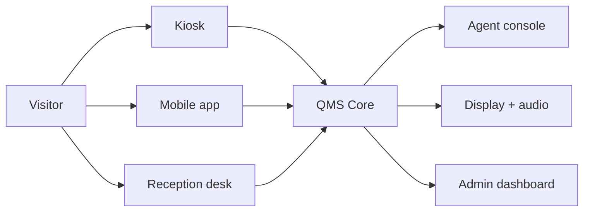
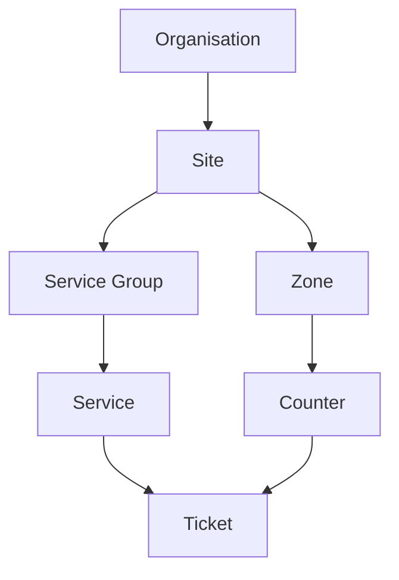
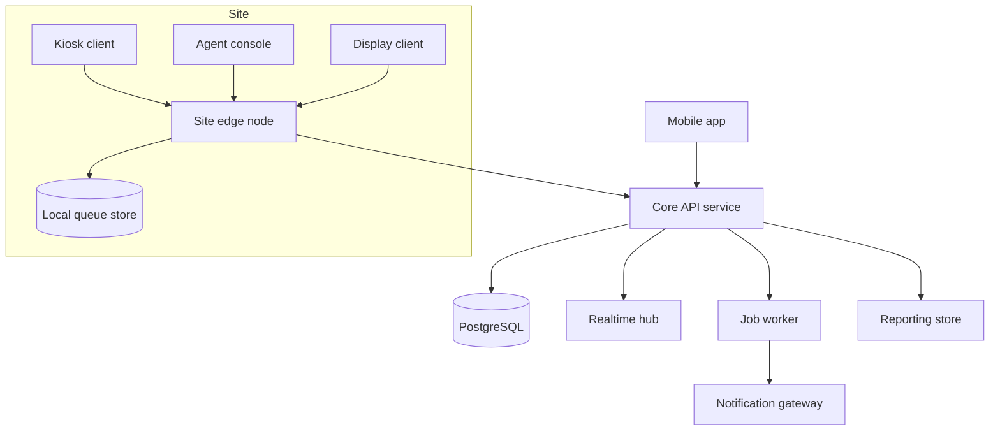
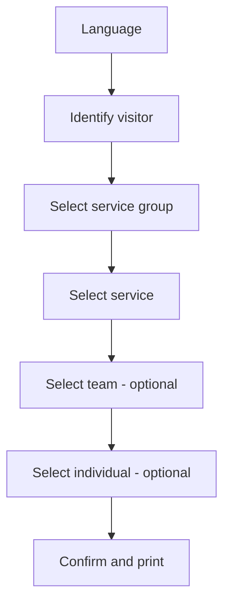
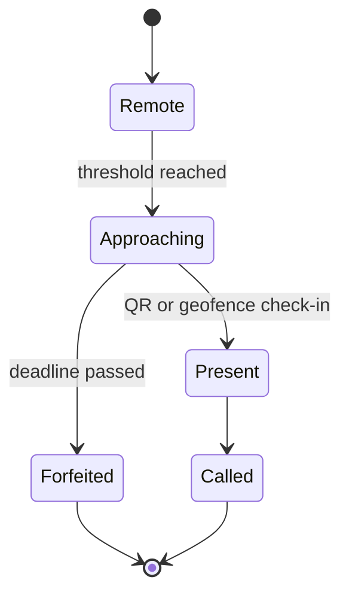
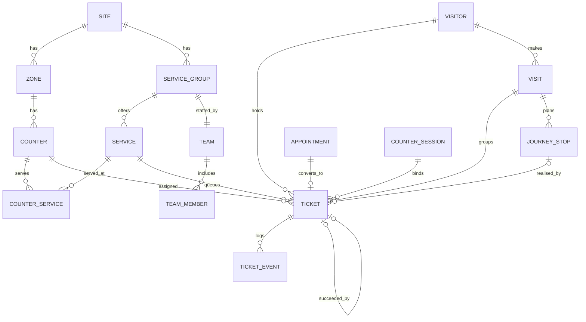
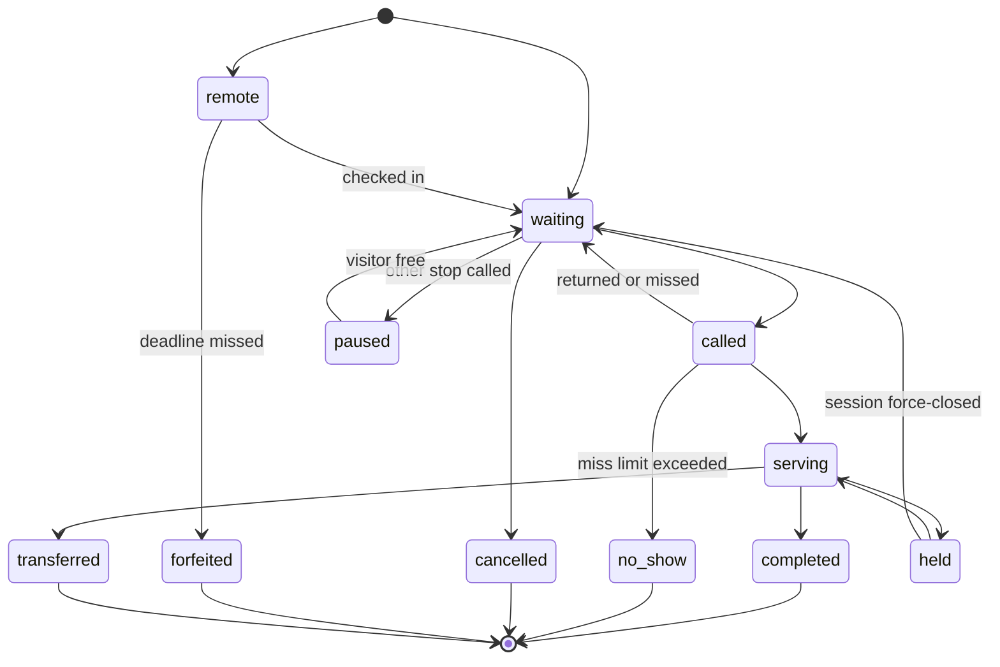
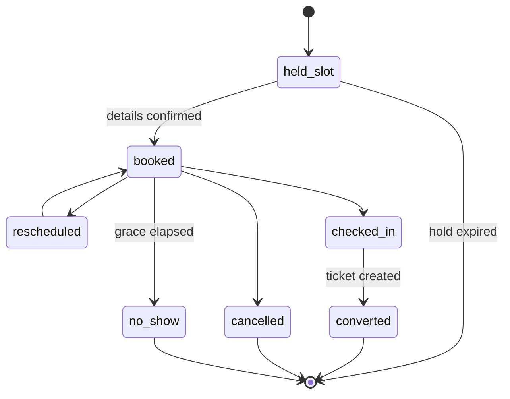
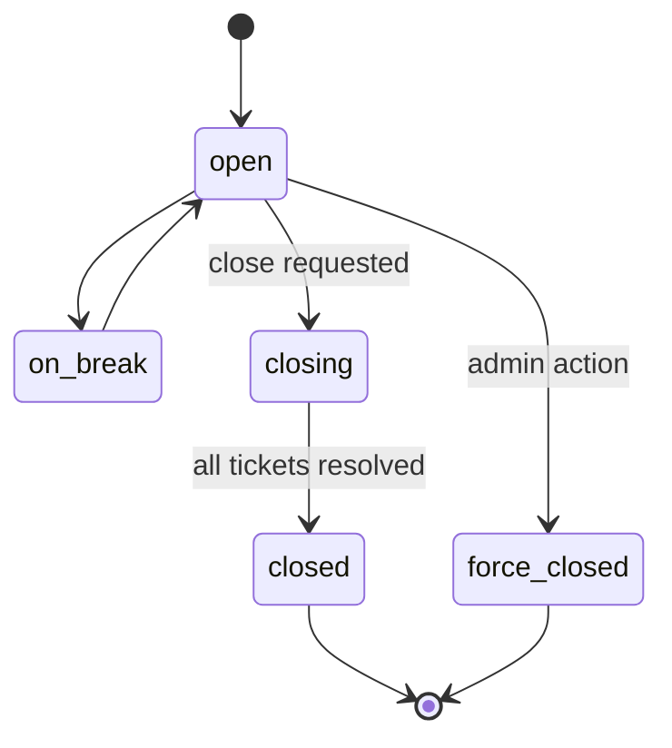
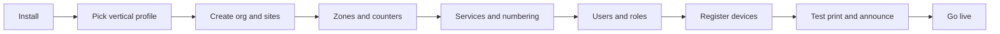

# Queue Management System — Software Requirements Specification

2026-09-18 · @Someone

**Version 1.3 (draft) · Single-tenant, configuration-driven · Vertical-agnostic (banking, healthcare, producer/supplier services, government services, retail service desks)**

## 1. Purpose, Scope and Conventions

This document specifies a Queue Management System (QMS) that any service organisation can install and configure for its own premises without code changes. It is written to be built from: it fixes the data model, APIs, state machines and non-functional targets, not just the business intent.

### 1.1 Scope

The product is delivered in two phases. Phase 1 is the working queue system; Phase 2 adds the capabilities that depend on device drivers, mobile push infrastructure and production telemetry.

**Phase 1 scope:**

- Token issuance across four channels: self-service kiosk, staff-assisted reception, mobile web app (PWA), and appointment check-in.
- Appointment pre-booking and scheduling, including phone bookings entered by staff.
- Virtual (remote) queuing from a mobile phone's browser, with live position and arrival window.
- Queue routing, priority handling, counter assignment, transfer, re-announce and miss.
- Counter/agent console, display boards, and voice announcement using browser-standard printing and audio.
- Administration, live monitoring, KPIs and reporting.
- Multilingual UI and announcements (English and Bangla at minimum).
- Stateless JWT authentication with Spring Security, and role-based access control (§20.2).
- Notifications by Web Push, email and in-app realtime (ADR-0011).
- A single-site-LAN deployment: the core server runs on the client's LAN, with no site edge node (ADR-0001).

Architecture and domain decisions behind this version are recorded in `docs/adr/`; the domain glossary is `CONTEXT.md`.

**Phase 2 scope:**

| Capability | Why deferred | Specified in |
| --- | --- | --- |
| Native mobile apps (Android, iOS) and native push (FCM, APNs) | Needs store accounts, signing certificates and per-client sender setup; the mobile web app with Web Push covers Phase 1 | §13, §14 |
| SMS notifications and phone OTP | Needs a per-client SMS aggregator; Web Push, email and in-app realtime cover Phase 1 (ADR-0011) | §14 |
| Site edge node and offline operation | A second queue engine with reconciliation; Phase 1 runs the core on the client LAN (ADR-0001) | §6.3 |
| Cross-site transfer | Journeys and transfers are intra-site in Phase 1 (ADR-0002) | FR-QUE-054 |
| Hardware and peripheral integration | ESC/POS thermal drivers, card readers, QR scanners, LED counter indicators and amplifier control each need device-specific work per client | §22.6 |
| Observability stack | Metrics and distributed tracing are operational maturity, not launch blockers; structured logging and health checks ship in Phase 1 | §23.6 |
| MFA, OIDC and LDAP/AD identity | Phase 1 uses local accounts with JWT | §22.1, §25.1 |

Phase 2 items are deferred, not dropped. Each one names the seam Phase 1 must already build so the later work is an added implementation rather than a rewrite.

Out of scope entirely, with extension points defined in §22: core banking, HIS/EMR and ERP integrations; payment collection; video calling; biometric identification; physical access control.

### 1.2 Intended audience

Engineering (implementation), QA (test design), solution consultants (client configuration), infrastructure (deployment and sizing), and the client's project sponsor (scope sign-off).

### 1.3 Requirement identifiers

Every requirement carries a stable ID that survives renumbering of sections.

| Prefix | Meaning | Example |
| --- | --- | --- |
| `FR-<AREA>-<nnn>` | Functional requirement | `FR-QUE-014` |
| `NFR-<CAT>-<nnn>` | Non-functional requirement | `NFR-PERF-003` |
| `CFG-<nnn>` | Configurable item (no code change) | `CFG-021` |
| `API-<nnn>` | API endpoint contract | `API-032` |

Areas: `CFG` configuration, `ISS` issuance, `APT` appointments, `QUE` queue engine, `AGT` agent console, `DSP` display and audio, `MOB` mobile, `NTF` notifications, `MON` monitoring, `RPT` reporting, `I18N` localisation.

The key words MUST, SHOULD and MAY are used as defined in RFC 2119. "MUST" marks acceptance-blocking behaviour.

### 1.4 Definitions

| Term | Definition |
| --- | --- |
| Visitor | Any person who joins a queue: customer, patient, producer, supplier, vendor, citizen. |
| Ticket | One instance of a visitor waiting for one service. Carries a token number. A change of service always means a new ticket. |
| Token number | The human-readable label printed and announced, e.g. `S-042`. Allocated once per visit chain and shared by successor tickets (ADR-0006). |
| Service | A unit of work a visitor queues for, e.g. "Account opening", "Blood collection", "Order and costing". |
| Service group | A container of services, usually mapped to a department, clinic or branch function. |
| Counter | A physical or logical serving position (window, desk, consultation room). |
| Agent | A staff member who serves tickets at a counter. |
| Visit | One visitor's presence at one site on one occasion. Every ticket belongs to exactly one visit (ADR-0007). |
| Journey | An optional plan on a visit: the ordered or unordered set of services the visitor needs. Holds services, not tickets. |
| Site | The operational unit (branch or campus) that owns business hours, timezone, a token numbering space and visits. May span several buildings (ADR-0002). A deployment may have several. |
| Zone | A waiting area inside a site, labelled by building and floor. |
| Successor ticket | The ticket created by a transfer; same visit and token number as its predecessor (ADR-0006). |
| Re-announce / Miss | Re-announce replays the call for a called ticket. Miss declares the visitor absent and returns the ticket to the queue, or makes it a no-show past the limit (ADR-0005). The word "recall" is not used. |
| Vertical profile | A packaged configuration set that adapts the product to an industry. |

## 2. Product Overview and Deployment Model

The QMS is a single-tenant product: each client organisation gets its own isolated installation, on their premises or in their private cloud. There is one codebase and one release train; client differences are expressed entirely as configuration and language packs.

### 2.1 Why single-tenant

| Consequence | Design implication |
| --- | --- |
| One database per client | No `tenant_id` column anywhere. Row-level tenant filtering is not needed and MUST NOT be added. |
| Client-controlled data residency | The product MUST run with no outbound internet dependency for core queuing (see NFR-AVL-004). |
| Client-controlled upgrade window | Schema migrations MUST be forward-only, idempotent and runnable offline. |
| Per-client branding | Logo, colours, token layout and announcement voice are configuration, not a build. |
| Support access may be restricted | Diagnostics MUST be collectable as a single exportable bundle. |

An installation MAY still serve multiple sites (branches, buildings) under one organisation — that is modelled as org hierarchy, not as multi-tenancy.

### 2.2 Product perspective

The system replaces per-department standalone queue machines with one central queue hub that spans sites, floors and departments, and adds remote and appointment-based entry to the same queue.



All four entry channels write into one queue engine, so a visitor's position is the same regardless of how they joined.

### 2.3 User classes

| Class | Typical volume per site | Primary surface |
| --- | --- | --- |
| Visitor | Hundreds per day | Kiosk, mobile app, display |
| Agent | 50–250 | Agent console (web) |
| Team admin | 5–30 | Admin web |
| Org admin | 1–5 | Admin web |
| System administrator | 1–2 | Admin web + server access |

### 2.4 Operating assumptions

- Sites have local LAN; internet may be intermittent.
- Kiosks are unattended for long periods and MUST recover from power loss without staff action.
- Some visitors are pre-registered in the client's records (customer, patient, producer); others are walk-ins with no record.

## 3. Configuration Philosophy and Vertical Profiles

One codebase serves a bank, a hospital and a producer-services campus because every industry-specific word, rule and screen element is data. A vertical profile is a seed file that pre-populates that data; consultants then edit it per client.

### 3.1 The rule

**CFG-001.** No requirement in this document may be satisfied by an `if (industry == "bank")` branch. Industry variation MUST be expressed as configuration values, label overrides, or an enabled/disabled feature flag.

### 3.2 Terminology remapping

Every visitor-facing noun is a label key resolved through the active language pack and profile. The same screen renders differently with no code change.

| Label key | Bank | Medical centre | Producer/supplier services |
| --- | --- | --- | --- |
| `entity.visitor` | Customer | Patient | Producer |
| `entity.visitor_id` | Account / CIF number | Patient ID / MRN | Producer code |
| `entity.service_group` | Branch function | Department / clinic | Department |
| `entity.counter` | Counter | Consultation room | Desk |
| `entity.agent` | Officer | Doctor / technician | Officer |
| `entity.category` | Segment (Retail, Priority) | Visit type (New, Follow-up) | Producer category (e.g. Children Tailoring) |
| `entity.ticket` | Token | Token | Token |

### 3.3 What a vertical profile carries

1. Label overrides for the keys above.
2. A starter service catalogue.
3. Default priority classes.
4. Default token-numbering rules.
5. Default report selection and KPI thresholds.
6. Feature flags on or off.

### 3.4 Shipped profiles

| Profile | Starter services | Default priority classes | Notable flags |
| --- | --- | --- | --- |
| `banking` | Cash deposit, Cash withdrawal, Account opening, Loan enquiry, Card services, Remittance | Priority banking, Senior citizen, Differently abled, Normal | Appointment `on`, Virtual queue `on`, Journey `off` |
| `healthcare` | Registration, Consultation, Sample collection, Pharmacy, Billing, Report collection | Emergency, Elderly, Pregnancy, Follow-up, Normal | Appointment `on`, Journey `on`, Announce visitor name `off` |
| `producer_services` | Helpdesk query, Sample, Order and costing, Pre-QC, Voucher, Documentation | Distant-district producer, Scheduled visit, Normal | Journey `on`, Multi-site `on`, Visitor-code lookup `on` |
| `government` | Application submission, Verification, Payment, Collection | Senior citizen, Differently abled, Normal | Appointment `on`, Virtual queue `off` |
| `generic` | One sample service | Normal | All optional flags `off` |

### 3.5 Profile application

**CFG-002.** A profile MUST be applied only at first-run setup or through an explicit "reset to profile" action; it MUST NOT silently overwrite a live configuration on upgrade.

**CFG-003.** Any configuration value a profile sets MUST be editable afterwards through the admin UI.

**CFG-004.** The full configuration MUST be exportable and importable as a single signed JSON bundle, so a client's setup can be cloned into a test environment.

## 4. Domain Model and Terminology

The domain has one organisation, a physical hierarchy beneath it, a service catalogue that hangs off that hierarchy, and tickets that flow through both.

### 4.1 Core structure



A ticket is created against a service and later bound to a counter. Zones exist so that displays and announcements can be scoped to a waiting area rather than a whole building.

### 4.2 Entity meanings

| Entity | Meaning | Cardinality |
| --- | --- | --- |
| Organisation | The client. Exactly one per installation. | 1 |
| Site | The operational unit (branch or campus) with its own address, business hours, timezone and numbering space. May span several buildings. | 1..n |
| Zone | A waiting area within a site, identified by building, floor and name. Owns displays and speakers. | 1..n per site |
| Counter | A serving position inside a zone. Has a display label such as "Counter 3". | 1..n per zone |
| Service group | A department or clinic. Owns a set of services and a team. | 1..n per site |
| Service | The thing a visitor queues for. Owns SLA, average handling time and token prefix. | 1..n per group |
| Team | The set of agents who can serve a service group. | 1 per group |
| Agent | A staff user who can occupy a counter. | 1..n per team |
| Visitor | A person. May be pre-registered or anonymous. | 0..n |
| Visit | One visitor's presence at one site on one occasion. Created implicitly with the first ticket. | 1 per ticket chain |
| Ticket | One visitor waiting for one service. | 1..n per visit |
| Journey | An optional plan of stops (services), ordered or unordered, attached to a visit. Each stop is realised by a ticket. | 0..1 per visit |
| Appointment | A reserved slot that converts into a ticket at check-in. | 0..n |

### 4.3 Relationships that are not obvious

- **A service may be servable at more than one counter, and a counter may serve more than one service.** The link is a many-to-many `counter_service` table with a `skill_level` used for routing preference.
- **An agent is not permanently attached to a counter.** The agent opens a session on a counter; the session is what routing sees.
- **A ticket's service group is derived from its service**, and is stored denormalised on the ticket so historical reporting survives a service being moved.
- **A journey holds services; tickets realise its stops.** Each stop becomes its own ticket with its own token number and its own wait, so per-stop KPIs stay measurable. The visit, not the journey, groups the tickets (ADR-0007).
- **A transfer creates a successor ticket.** The transferred ticket closes; the successor keeps the same token number and visit, so per-service waits stay measurable without recomputation (ADR-0006).
- **A building is not a site.** Buildings of one campus are zones' `building_label`; journeys and transfers never cross sites (ADR-0002).

### 4.4 The token number

A token number is composed, never a raw database id.

`{prefix}{separator}{sequence}` — for example `S-042`, `QC0117`, `D100`.

| Part | Source | Configurable |
| --- | --- | --- |
| Prefix | Service, service group, or priority class, per `CFG-018` | Yes |
| Separator | Organisation setting, may be empty | Yes |
| Sequence | Counter that resets on a defined boundary | Yes |

The combination of prefix and sequence MUST be unique within a site and a reset period. A token number is allocated once per visit chain: successor tickets created by transfer reuse it (ADR-0006). Token numbers MUST always use Western Arabic digits (FR-I18N-020).

## 5. Actors, Roles and Permissions

Authorisation is simple role-based access control. Each role carries a fixed permission set defined in code. A user is assigned one or more roles, and effective permissions are the union of those sets. Where a role applies only to part of the organisation, the assignment names the sites or service groups it covers, and those ids travel in the token as claims.

### 5.1 Actors

| Actor | Authenticated | Scope of a typical assignment |
| --- | --- | --- |
| System Administrator | Yes | Organisation |
| Org Admin | Yes | Organisation or one site |
| Team Admin | Yes | One or more service groups |
| Agent | Yes | One or more service groups |
| Reception Operator | Yes | One site |
| Kiosk | Device credential | One site |
| Display | Device credential | One zone |
| Visitor (registered) | Yes, mobile | Own tickets only |
| Visitor (anonymous) | Ticket secret | One ticket |
| Reporting/BI consumer | Yes, service account | Read-only, organisation |

### 5.2 Permission matrix

`Y` = allowed within scope, `—` = denied, `S` = allowed but only on own records.

| Permission | SysAdmin | Org Admin | Team Admin | Agent | Reception | Visitor |
| --- | --- | --- | --- | --- | --- | --- |
| Configure org, sites, zones | Y | Y | — | — | — | — |
| Manage service catalogue | Y | Y | — | — | — | — |
| Manage priority and routing rules | Y | Y | — | — | — | — |
| Create/disable user accounts | Y | Y | — | — | — | — |
| Assign roles | Y | Y | — | — | — | — |
| Request team member assignment | Y | Y | Y | — | — | — |
| Approve team member assignment | Y | Y | — | — | — | — |
| Request counter allocation | Y | Y | Y | — | — | — |
| Approve counter allocation | Y | Y | — | — | — | — |
| Open/close a counter session | Y | Y | Y | S | — | — |
| Call next / serve / complete | — | — | Y | S | — | — |
| Transfer a ticket | — | Y | Y | S | — | — |
| Re-prioritise a waiting ticket | Y | Y | Y | — | Y | — |
| Issue a ticket for a visitor | — | — | — | — | Y | — |
| Cancel a waiting ticket | Y | Y | Y | S | Y | S |
| Force-set agent availability | Y | Y | Y | — | — | — |
| View live dashboard (all groups) | Y | Y | — | — | — | — |
| View live dashboard (own groups) | Y | Y | Y | S | Y | — |
| Run and export reports | Y | Y | Y | — | — | — |
| View visitor PII | Y | Y | Y | S | Y | S |
| Manage notice-board content | Y | Y | Y | — | — | — |
| Read audit log | Y | Y | — | — | — | — |
| Book an appointment | Y | Y | Y | — | Y | S |

### 5.3 Requirements

**FR-CFG-101.** Roles MUST be a fixed, code-defined set matching §5.2. Which users hold which roles is configurable per client; the permissions inside a role are not. Only the role's display name is localisable. This is a deliberate simplification: a per-client permission editor is a Phase 2 consideration, not a Phase 1 requirement.

**FR-CFG-102.** Team Admin actions marked as requiring approval (team membership, counter allocation) MUST create an approval request visible to Org Admin, and MUST NOT take effect until approved.

**FR-CFG-103.** Every permission check MUST be enforced server-side. Hiding a UI control is not sufficient.

**FR-CFG-104.** Disabling a user MUST immediately close their open counter session, return every ticket bound to that session (called, serving or held) to `waiting` at the front of its queue (ADR-0008), invalidate their refresh tokens so no new access token can be minted, and publish `principal.changed` so their realtime connections drop at once (ADR-0009). Their current access token stays valid for REST until it expires (API-013); because the counter session is closed and the refresh is refused, the practical exposure is at most 15 minutes of REST read access with no ability to call, serve or complete.

**FR-CFG-105.** Where §5.2 marks a permission `S` (own records only), the check MUST be an object-level check in the service layer, not a role claim. For an agent, "own" means the ticket's session binding (`ticket.counter_session_id`) points at that agent's current open counter session — not merely that the agent's id appears somewhere on the row. The binding is held through `called`, `serving` and `held` (ADR-0008).

**FR-CFG-106.** A scope id supplied by a client (`site_id`, `service_group_id`) MUST be intersected with the principal's scope claims before use, never trusted directly.

**FR-CFG-107.** An approval request under FR-CFG-102 MUST be modelled as a pending row an Org Admin acts on. It MUST NOT be implemented by temporarily granting the Team Admin a higher role.

**FR-CFG-108.** A build-time test MUST assert that every controller method is either secured or explicitly listed as public, so the matrix in §5.2 cannot silently drift from the code.

## 6. System Architecture

A site keeps serving tickets when the internet is unreachable, because in Phase 1 the core runs on the client's LAN. Serving through an outage of the core itself (the site edge node) is Phase 2 (ADR-0001).

### 6.1 Components



| Component | Responsibility | Notes |
| --- | --- | --- |
| Core API service | All business rules, authorisation, persistence | Stateless, horizontally scalable |
| Realtime hub | Pushes queue state to consoles, displays, mobile web | WebSocket, see §21; runs inside the backend application |
| Site edge node | Local cache and write buffer for one site | **Phase 2** (ADR-0001) |
| Job worker | Notifications, report generation, scheduled resets | Idempotent, at-least-once; runs inside the backend application |
| Reporting store | Denormalised read model for analytics | Separate schema in the same PostgreSQL; refreshed continuously |
| Kiosk client | Touch UI, printing | Windows or Android, kiosk-locked |
| Display client | TV rendering, audio playback | Browser or Android TV |
| Notification gateway | Web Push/email adapters (SMS and native push in Phase 2) | Pluggable per client |

**Deployment shape (ADR-0010).** The frontend applications (kiosk, console, display, admin, visitor web app) are deployed separately from the backend and talk to it over REST plus WebSocket push. The backend is one Spring Boot application containing the core API, realtime hub and job worker, with one package per bounded context: configuration, issuance, queue, appointment, session, notification, reporting, identity, audit. With more than one backend node, realtime fan-out between nodes uses PostgreSQL `LISTEN/NOTIFY`, and scheduled jobs run once cluster-wide under a PostgreSQL-backed lock (ShedLock). No message broker is required.

### 6.2 Technology constraints

**NFR-POR-001.** The server stack MUST run on Linux x86-64 with Docker or Podman, and MUST also install on Windows Server for clients who require it.

**NFR-POR-002.** The primary datastore MUST be PostgreSQL 14 or later. No feature may depend on a proprietary database extension.

**NFR-POR-003.** Client applications (kiosk, console, display, admin) MUST be browser-based, with a packaged shell for kiosk and TV hardware.

**NFR-POR-004.** The whole system MUST be installable from an offline artefact bundle with no package downloads at install time.

### 6.3 Offline and degraded operation

**Phase 1 position (ADR-0001).** The core runs on the client's LAN, so loss of internet does not stop queuing. NFR-AVL-004, FR-QUE-203 and FR-QUE-204 below are **Phase 2** and specify the site edge node. FR-QUE-201 (sequence blocks) and FR-QUE-202 (visible degradation) are Phase 1, and every `ticket_event` records both device time and server time so reconciliation can be added later.

**NFR-AVL-004.** *(Phase 2.)* If the core API is unreachable, the site edge node MUST continue to: issue tokens for local services, call and complete tickets, drive local displays and audio. It MUST queue all writes and reconcile on reconnect.

**FR-QUE-201.** Token sequences MUST remain collision-free across a partition. Each site holds a reserved sequence block; the edge node draws from it while offline and requests a new block when the block is 80% consumed.

**FR-QUE-204.** *(Phase 2.)* Stateless JWT validation works during a partition: the edge node verifies signatures against a cached public key with no call home. Two consequences MUST be handled. Revocation cannot reach a partitioned site, so a revoked token remains usable there until it expires. And an agent arriving during a partition cannot log in, because the login endpoint is unreachable — see the open question in §28.4.

**FR-QUE-202.** Features that depend on the internet MUST degrade visibly, not silently: remote mobile joins and Web Push notifications are disabled and shown as unavailable when the site loses internet connectivity.

**FR-QUE-203.** *(Phase 2.)* On reconnect, reconciliation MUST use server-recorded event time, and conflicts MUST be resolved last-writer-wins per ticket with the losing event retained in the audit log.

### 6.4 Environments

Each client installation SHOULD have three environments: production, staging (same version, anonymised data), and a training environment that can be reset from the configuration bundle.

## 7. FR-1 Configuration and Administration

Everything a solution consultant needs to stand up a new client MUST be reachable from the admin UI. Database edits are never part of a supported deployment.

### 7.1 Organisation and physical hierarchy

**FR-CFG-001.** Org Admin MUST be able to create, rename and deactivate sites, zones and counters. Deactivation is soft; historical tickets keep resolving to the deactivated record.

**FR-CFG-002.** Each site MUST carry a timezone, address, and default language. All timestamps are stored in UTC and rendered in site timezone.

**FR-CFG-003.** Each zone MUST carry a floor label (free text, e.g. "3rd", "Ground") and an optional building label (free text, e.g. "Block B", "Main building"), both used on tokens, displays and wayfinding (ADR-0002).

**FR-CFG-004.** Counters MUST have a short display label, a zone, and an optional physical location note.

### 7.2 Service catalogue

**FR-CFG-010.** A service MUST carry: name (per language), service group, token prefix, expected handling time in minutes, SLA wait target in minutes, enabled channels, and an active flag.

**FR-CFG-011.** A service MUST be assignable to counters with a preference weight (1 = primary, higher = fallback).

**FR-CFG-012.** Services MUST support a display order and an icon for the kiosk grid.

**FR-CFG-013.** A service MAY require a visitor identifier before a ticket is issued (configurable: not required, optional, mandatory).

**FR-CFG-014.** A service MAY be marked appointment-only, walk-in-only, or both.

**FR-CFG-015.** Deleting a service that has tickets MUST be blocked; only deactivation is allowed.

### 7.3 Business hours, holidays and capacity

**FR-CFG-020.** Each site MUST have weekly operating hours, and each service MAY override them.

**FR-CFG-021.** A holiday calendar MUST be maintainable per site, including half-days.

**FR-CFG-022.** Token issuance MUST stop at a configurable cut-off before closing time, separately per channel (for example, kiosk stops 30 minutes before close, mobile 60 minutes before).

**FR-CFG-023.** A daily issuance cap MUST be configurable per service, with a configurable message shown when the cap is reached.

### 7.4 Token numbering

**FR-CFG-018.** Token numbering rules MUST be configurable per service or per service group, with these parameters:

| Parameter | Values | Default |
| --- | --- | --- |
| Prefix source | service, service group, priority class, fixed string | service group |
| Sequence start | integer | 1 |
| Sequence padding | 0–6 digits | 3 |
| Reset boundary | daily, weekly, monthly, never | daily |
| Reset time | local time of day | 00:00 |
| Separator | any string including empty | `-` |

**FR-CFG-019.** Scheduled resets MUST be executed by the job worker at site-local reset time, and MUST be replayable if the worker was down.

### 7.5 Branding and print layout

**FR-CFG-030.** Logo, primary colour, and organisation name MUST be configurable and applied to kiosk, display, printed token, mobile app and reports.

**FR-CFG-031.** The printed token layout MUST be editable as a template with a fixed set of available fields: token number, building, floor, service group, service, visitor code, visitor name, visitor category, counter (if pre-assigned), issue time, estimated wait, QR code, notice line.

**FR-CFG-032.** A template MUST be previewable and test-printable from the admin UI without issuing a real token.

### 7.6 Configuration change control

**FR-CFG-040.** Changes to routing rules, priority classes, numbering and business hours MUST be versioned, with the author and timestamp recorded, and MUST be revertible to any prior version.

**FR-CFG-041.** A configuration change that would affect tickets already waiting MUST warn the admin and MUST NOT retroactively renumber or reprioritise issued tickets.

## 8. FR-2 Token Issuance Channels

Four channels create tickets. All of them call the same issuance service, so the queue never has to know where a ticket came from except for reporting and priority.

### 8.1 Common issuance rules

**FR-ISS-001.** Ticket creation MUST be atomic: sequence allocation, ticket row and queue insertion succeed or fail together.

**FR-ISS-002.** The issuance response MUST include token number, service, zone, building and floor, position in queue, estimated wait in minutes, and a ticket secret for anonymous status lookup.

**FR-ISS-003.** Issuance MUST be rejected with a specific reason code when: outside business hours, past channel cut-off, daily cap reached, service inactive, no agent rostered (configurable), or duplicate active ticket for the same visitor and service.

**FR-ISS-004.** Duplicate prevention MUST be configurable per service: allow, warn, or block when the visitor already has an active ticket for that service.

**FR-ISS-005.** Estimated wait MUST be computed as described in §10.5 and MUST never be presented as an exact promise.

### 8.2 Kiosk (self-service)

The kiosk walks the visitor down a configurable selection tree. Steps that resolve to a single option MUST be skipped automatically.



**FR-ISS-010.** The kiosk MUST support a selection tree of up to five levels: service group, service, team, individual agent, and one custom level defined in configuration.

**FR-ISS-011.** Each level MUST be individually enabled or disabled per service group.

**FR-ISS-012.** Selecting a specific individual MUST be permitted only when that agent is on duty, and MUST warn when that agent's queue is longer than the group queue.

**FR-ISS-013.** The kiosk MUST support visitor identification by: typed code, card or QR scan, mobile number, or "no identification" where the service allows it.

**FR-ISS-014.** When a visitor code resolves, the kiosk MUST show the visitor's name and category for confirmation before printing, and MUST NOT expose any other stored personal data.

**FR-ISS-015.** The kiosk MUST return to the idle screen after a configurable inactivity timeout (default 45 seconds) and MUST discard any partial selection.

**FR-ISS-016.** If the printer fails, the kiosk MUST still create the ticket and MUST display the token number in large type with a QR code. The QR code MUST open the ticket's status page in the mobile web app, where the visitor can follow the queue and opt into Web Push (ADR-0011). Sending the token by SMS is Phase 2.

**FR-ISS-017.** The kiosk MUST be operable entirely by touch, with all targets at least 48×48 px, and MUST support a configurable high-contrast and larger-text mode.

### 8.3 Reception-assisted issuance

**FR-ISS-020.** A Reception Operator MUST be able to issue a ticket on a visitor's behalf, search the visitor directory, assign a priority class, and add a note visible to the agent.

**FR-ISS-021.** Reception MUST be able to register an unknown walk-in visitor with a minimum record (name, phone, optional email, optional category, optional purpose) and issue a visitor pass reference. This replaces manual paper passes and makes the visit trackable.

**FR-ISS-022.** Reception MUST be able to issue a linked set of tickets for a multi-stop journey in one action. All tickets issued for one visitor in one visit MUST share one visit (ADR-0007).

### 8.4 Appointment check-in

**FR-ISS-030.** A visitor with an appointment MUST be able to check in at the kiosk by code or QR, at reception, or from the mobile web app inside a geofence.

**FR-ISS-031.** Check-in MUST be allowed only within a configurable window around the slot (default: 30 minutes before to 15 minutes after).

**FR-ISS-032.** Early check-in outside the window MUST offer the visitor a walk-in ticket instead, without cancelling the appointment.

**FR-ISS-033.** Late check-in beyond the grace period MUST follow the no-show policy in §9.5.

### 8.5 Mobile issuance

Covered in §13. Mobile-issued tickets MUST be indistinguishable from kiosk tickets to the queue engine except for the `origin_channel` attribute and any channel-specific priority configured.

## 9. FR-3 Appointment Booking and Scheduling

Appointments reserve capacity in advance and convert into tickets at check-in. The scheduler works on slot templates so that a doctor's clinic, a bank's relationship desk and a merchandiser's meeting hours all use the same mechanism.

### 9.1 Availability model

**FR-APT-001.** Availability MUST be definable at three levels, most specific winning: service, team, individual agent.

**FR-APT-002.** A slot template MUST carry: weekday pattern, start time, end time, slot duration in minutes, concurrent capacity per slot, and a validity date range.

**FR-APT-003.** Exceptions MUST be supported: blocked dates, one-off extra availability, and reduced capacity for a date.

**FR-APT-004.** Business hours and the holiday calendar MUST automatically suppress slots; an admin MUST be able to override for a specific date.

**FR-APT-005.** A configurable booking horizon (default 30 days) and a minimum lead time (default 2 hours) MUST be enforced.

### 9.2 Booking

**FR-APT-010.** A visitor MUST be able to search availability by service, then by date, and see only slots with remaining capacity.

**FR-APT-011.** Booking MUST be transactional against remaining capacity; two simultaneous bookings for the last seat MUST result in exactly one success.

**FR-APT-012.** A slot MUST be held for a configurable period (default 5 minutes) while the visitor completes booking details, then released.

**FR-APT-013.** Staff MUST be able to book on a visitor's behalf, recording the booking source as `phone`, `walk_in` or `staff`. This covers phone-call booking for a designated time slot.

**FR-APT-014.** Every appointment MUST receive a unique reference code and a QR code usable for check-in.

**FR-APT-015.** Booking MUST capture: visitor identity or minimal contact record, service, slot, optional preferred agent, optional purpose note, and preferred language.

**FR-APT-016.** A configurable maximum number of active appointments per visitor MUST be enforceable (default 3).

### 9.3 Rescheduling and cancellation

**FR-APT-020.** A visitor MUST be able to reschedule or cancel up to a configurable cut-off before the slot (default 2 hours). Staff MUST be able to do so at any time with a reason.

**FR-APT-021.** Rescheduling MUST preserve the original reference code and MUST record the change history.

**FR-APT-022.** Cancellation MUST immediately return capacity to the slot and SHOULD notify any waitlisted visitor.

**FR-APT-023.** A waitlist per slot MAY be enabled per service; when capacity frees, the first waitlisted visitor is offered the slot for a configurable hold period.

### 9.4 Conversion to a ticket

**FR-APT-030.** On check-in, the appointment MUST create a ticket whose priority reflects the appointment priority class, and MUST record the difference between slot time and actual check-in time.

**FR-APT-031.** An appointment ticket MUST NOT be able to displace a ticket already being served.

**FR-APT-032.** Where an appointment's slot time has passed and the visitor checked in on time, the ticket MUST be ordered ahead of walk-ins whose wait began after the slot time, so appointment-keeping is rewarded without starving the walk-in queue. The exact ordering rule is defined in §10.3.

### 9.5 No-show handling

**FR-APT-040.** An appointment not checked in by slot time plus grace period MUST be marked `no_show` automatically.

**FR-APT-041.** A no-show MUST free its capacity immediately.

**FR-APT-042.** A configurable policy MAY restrict booking for a visitor after N no-shows in a rolling window (default: disabled; when enabled, 3 no-shows in 90 days blocks online booking but never blocks walk-in).

**FR-APT-043.** No-show rate MUST be reportable per service, per agent and per visitor category.

### 9.6 Reminders

**FR-APT-050.** Reminders MUST be sendable at configurable offsets (default: 24 hours and 1 hour before), through the channels in §14, in the visitor's preferred language.

## 10. FR-4 Queue Engine

The queue engine decides which waiting ticket a free counter gets next. It is the only place where ordering is computed, and its rule set is configuration, not code.

### 10.1 Queues

**FR-QUE-001.** A queue MUST exist per (site, service) pair. Queues are logical; tickets are never physically moved between tables.

**FR-QUE-002.** A counter MUST be able to draw from several queues according to its `counter_service` links and their preference weights.

**FR-QUE-003.** A ticket targeted at a specific agent MUST be held in that agent's personal queue and MUST NOT be drawn by another counter unless an admin reassigns it.

### 10.2 Priority classes

**FR-QUE-010.** Priority classes MUST be configurable, each with a name, a head start in minutes (normal = 0), and an optional maximum wait target (ADR-0003).

**FR-QUE-011.** A ticket MUST receive a priority class from, in order of precedence: manual assignment by staff, appointment class, visitor category mapping, channel default, service default.

**FR-QUE-012.** Staff with the re-prioritise permission MUST be able to change a waiting ticket's class, with a mandatory reason recorded in the audit log.

### 10.3 Ordering rule

**FR-QUE-020.** The default ordering score for a waiting ticket MUST be:

`score = effective_wait_minutes + headstart_minutes + appointment_bonus + escalation_bonus + score_adjustment_minutes`

| Term | Definition |
| --- | --- |
| `effective_wait_minutes` | Minutes since the ticket entered `waiting`, excluding time in `paused`. For a checked-in appointment, minutes since the later of slot time and check-in time. |
| `headstart_minutes` | The priority class's head start: minutes of virtual waiting granted on arrival. Normal = 0. |
| `appointment_bonus` | Fixed configurable bonus in minutes for a checked-in appointment (default 15). |
| `escalation_bonus` | Grows once a ticket's real wait passes its class's maximum wait target, per FR-QUE-022. |
| `score_adjustment_minutes` | Signed offset set once by a positional move (delay, forfeit, Miss re-entry, call timeout), per ADR-0004. Default 0. |

All terms are in minutes, so every waiting ticket's score grows at the same rate and a priority class takes effect on arrival (ADR-0003). The highest score is served first. Ties break by earliest ticket creation time, then by lowest ticket id.

**FR-QUE-021.** The scoring formula MUST be selectable per service group from a set of named strategies: `weighted_wait` (above), `strict_priority` (class first, then FIFO), and `fifo` (creation order only).

**FR-QUE-022.** Anti-starvation MUST be enforced: once a ticket's wait exceeds its class's maximum wait target, `escalation_bonus` MUST increase so that the ticket is served before any lower-priority ticket, and the dashboard MUST flag it. Escalation is measured on real wait and MUST override any negative `score_adjustment_minutes`.

**FR-QUE-023.** The engine MUST expose a dry-run endpoint that returns the computed order for a queue with each term shown, so configuration can be validated without serving anyone.

### 10.4 Assignment

**FR-QUE-030.** When a counter requests the next ticket, the engine MUST select, among all queues that counter serves, the eligible ticket with the highest score, preferring lower-weight (primary) service links when scores are within a configurable tolerance.

**FR-QUE-031.** Assignment MUST bind the ticket to the calling counter session (`ticket.counter_session_id`), set under optimistic concurrency on `ticket.version`, so no two counters can call the same ticket (ADR-0008).

**FR-QUE-032.** If the agent does not act on a called ticket within a configurable timeout (default 90 seconds), the system MUST prompt the agent and MAY return the ticket to the queue with its original wait preserved; its position is restored with a score adjustment, never by rewriting `queued_at` (ADR-0004).

**FR-QUE-033.** Load balancing MUST be observable: the dashboard MUST show tickets served per open counter for the current period.

### 10.5 Wait estimation

**FR-QUE-040.** Estimated wait MUST be computed as:

`estimate = (tickets_ahead ÷ max(open_counters, 1)) × rolling_average_handling_time`

**FR-QUE-041.** `rolling_average_handling_time` MUST use the trailing 20 completed tickets for that service at that site, falling back to the configured expected handling time when fewer than 5 samples exist.

**FR-QUE-042.** Estimates MUST be recomputed on every queue change and MUST be presented as a rounded range (for example "about 15–20 minutes").

### 10.6 Re-announce, Miss, transfer and escalation

**FR-QUE-050.** An agent MUST be able to *Miss* a called ticket (declare the visitor absent). Each Miss increments `miss_count` and returns the ticket to `waiting`; when `miss_count` would exceed a configurable limit (default 2), the Miss instead closes the ticket as `no_show` (ADR-0005). *Re-announce* (replaying the call) does not count towards this limit.

**FR-QUE-051.** A missed ticket MUST re-enter the queue at a configurable position: front, after N tickets (default 3), or back. The position is applied as a score adjustment (ADR-0004).

**FR-QUE-052.** An agent MUST be able to transfer a ticket to another service, another counter, or a specific agent, with a mandatory note. A transfer closes the current ticket as `transferred` and creates a successor ticket in the target (ADR-0006).

**FR-QUE-053.** A successor ticket MUST share its predecessor's visit and token number, MUST reference it through `predecessor_ticket_id`, and MUST inherit its priority class. The predecessor's wait stops at transfer; the successor's wait starts at transfer, with a configurable transfer head start (default: equal to the predecessor's accrued wait) so the visitor is not sent to the back. Reports attribute each wait to its own ticket's service.

**FR-QUE-054.** *(Phase 2.)* Cross-site transfer MUST be supported where sites share an organisation and MUST be disabled when the site is operating offline. In Phase 1 transfers are intra-site (ADR-0002).

### 10.7 Journeys

**FR-QUE-060.** A journey MUST be definable as an ordered or unordered set of services, either from a template or ad hoc at issuance. It is stored as journey stops on the visit (`journey_stop`), each realised by a ticket when issued (ADR-0007).

**FR-QUE-061.** For an ordered journey, the next stop's ticket MUST be created automatically on completion of the previous stop, and MUST inherit the visitor's priority class.

**FR-QUE-062.** For an unordered journey, all tickets MUST be created upfront and the visitor MUST be shown which stop is callable soonest.

**FR-QUE-063.** A visitor MUST NOT be callable at two counters simultaneously; when a ticket is called, the other waiting tickets in the same visit MUST be marked `paused` and MUST NOT accrue wait time until the visitor is free.

**FR-QUE-064.** Journey completion, total journey duration and per-stop wait MUST be reportable.

## 11. FR-5 Counter and Agent Console

The console is the only screen most staff will ever use, and it is used all day. It MUST be operable from the keyboard alone and MUST never lose a ticket because a browser tab closed.

### 11.1 Counter session

**FR-AGT-001.** An agent MUST open a session by selecting a counter from those they are permitted to occupy. A counter MUST NOT hold two open sessions.

**FR-AGT-002.** If a counter already has an open session from a stale device, an Org Admin or Team Admin MUST be able to force-close it, with an audit entry.

**FR-AGT-003.** On session open, the agent MUST select which of the counter's services they will serve in this session, defaulting to all.

**FR-AGT-004.** A session MUST survive browser refresh, network loss under 5 minutes, and device restart, restoring the in-progress ticket.

**FR-AGT-005.** Closing a session MUST require the agent to resolve any in-progress ticket (complete, transfer or return to queue).

### 11.2 Serving actions

| Action | Effect | Shortcut |
| --- | --- | --- |
| Call next | Engine assigns highest-scoring eligible ticket, announcement fires | `F2` |
| Re-announce | Replay the call for the current called ticket; no state change | `F3` |
| Start service | Ticket moves to `serving`, service clock starts | `F4` |
| Complete | Ticket closes with outcome, service clock stops | `F5` |
| Miss | Visitor absent: ticket returns to the queue at the re-entry position, or closes as `no_show` once the miss limit is exceeded (FR-QUE-050) | `F6` |
| Transfer | Ticket closes as `transferred`; a successor ticket is created in the target service, counter or agent (FR-QUE-052) | `F7` |
| Hold | Ticket parked with its session binding kept, counter free to call next | `F8` |
| Break | Session pauses, counter stops receiving | `F9` |
| Close session | Session ends | `F10` |

**FR-AGT-010.** "Call next" MUST be disabled while a ticket is in `called` or `serving` state unless the parallel-serving flag is enabled for that service.

**FR-AGT-011.** The parallel-serving flag MUST allow a configurable maximum concurrent tickets per counter (default 1), for desks that handle several visitors at once.

**FR-AGT-012.** An agent MUST be able to call a specific waiting ticket out of order where permitted, with a mandatory reason.

**FR-AGT-013.** Holding a ticket MUST keep it out of the general queue, bound to the agent's counter session (ADR-0008), and MUST show it in a "held by me" list that the agent MUST clear before closing the session. The number of held tickets per session MUST NOT exceed a configurable hold limit (default 3). A force-closed session returns its held tickets to `waiting` at the front of their queues.

### 11.3 Breaks and availability

**FR-AGT-020.** Break types MUST be configurable (for example: lunch, prayer, meeting, system issue) with an optional maximum duration.

**FR-AGT-021.** Starting a break MUST stop new assignments immediately, and MUST require the current ticket to be resolved first.

**FR-AGT-022.** Break duration MUST be recorded and reportable per agent and per break type.

**FR-AGT-023.** A break exceeding its maximum duration MUST raise a dashboard alert to the Team Admin.

**FR-AGT-024.** Team Admin and Org Admin MUST be able to change an agent's availability status directly.

### 11.4 Visitor context and outcome

**FR-AGT-030.** When a ticket is called, the console MUST show: token number, visitor name and code where available, visitor category, service, purpose note, wait so far, channel of origin, and whether this is an appointment.

**FR-AGT-031.** For a journey visitor, the console MUST show the visit's other stops and their status.

**FR-AGT-032.** On completion the agent MUST record an outcome from a configurable list per service (for example: resolved, partially resolved, referred, documents missing), and MAY add a free-text note.

**FR-AGT-033.** Outcome codes MUST be reportable and MUST be configurable without code change.

**FR-AGT-034.** The console MUST NOT display visitor data beyond the configured field set for that role, per §25.

### 11.5 Agent-visible performance

**FR-AGT-040.** The console MUST show the agent their own current-day counts: served, in queue for their services, average service time, and break time. It MUST NOT rank agents against each other on the agent's own screen.

## 12. FR-6 Display Boards and Voice Announcement

A display is a dumb, resilient client: it subscribes to a zone, renders what it is told, and recovers by itself.

### 12.1 Display configuration

**FR-DSP-001.** Each display MUST be registered as a device with a name, a zone, a layout, and a language cycle.

**FR-DSP-002.** A display MUST be assignable to one or more queues, one or more counters, or a whole zone.

**FR-DSP-003.** Layouts MUST be selectable from a shipped set and MUST be configurable for zone proportions without code change:

| Layout | Composition |
| --- | --- |
| `now_serving_table` | Table of serving token / counter / service, plus a next-token strip |
| `split_media` | Serving table on one side, media or notice panel on the other |
| `single_counter` | One large token number for a single counter or room |
| `summary_board` | Per-service waiting counts and estimated waits for an entrance lobby |

**FR-DSP-004.** The serving table MUST show at minimum: serving token number, counter label, service or staff name, and MUST support a configurable column set.

**FR-DSP-005.** A next-token strip MUST show the next N tokens per queue (default 4).

**FR-DSP-006.** A notice panel MUST render content uploaded by an authorised user: images, video, or rich text, in a scheduled playlist with per-item start and end dates.

**FR-DSP-007.** Newly called tokens MUST be visually highlighted for a configurable period (default 10 seconds).

### 12.2 Display behaviour

**FR-DSP-010.** A display MUST update within 2 seconds of a call event (NFR-PERF-002).

**FR-DSP-011.** A display MUST reconnect automatically and MUST show a discreet stale-data indicator after 30 seconds without an update, rather than showing wrong data silently.

**FR-DSP-012.** A display MUST resume its assigned zone and layout automatically after power loss, with no login.

**FR-DSP-013.** Display device credentials MUST be revocable individually.

### 12.3 Voice announcement

**FR-DSP-020.** On a call event, the system MUST play an announcement in the zone containing that counter.

**FR-DSP-021.** The announcement text MUST be a configurable template per language, built from: token number, counter label, service name, floor, and optional visitor name.

**FR-DSP-022.** Announcing the visitor's name MUST be a per-service flag, default off, because it is inappropriate in medical settings.

**FR-DSP-023.** Announcements MUST play in each configured language in sequence, in a configurable order.

**FR-DSP-024.** Audio MUST support two modes: pre-recorded clip assembly (digits, prefixes, counters) and text-to-speech. Clip assembly MUST be available offline.

**FR-DSP-025.** A chime MUST play before the announcement, selectable and volume-controllable per zone.

**FR-DSP-026.** Announcements MUST queue, not overlap. A maximum queue depth MUST be configurable; when exceeded, only the most recent calls per counter are announced.

**FR-DSP-027.** A quiet period MUST be configurable per zone (time ranges where audio is suppressed but displays still update).

**FR-DSP-028.** Repeat announcement MUST fire on Re-announce, with a configurable maximum repeat count (`announce_count`).

### 12.4 Bangla and multilingual audio

**FR-DSP-030.** Digit and letter pronunciation MUST be correct per language; token prefixes MUST have a per-language spoken form defined in configuration (for example, prefix `QC` spoken as letters in English and as a configured Bangla phrase).

**FR-DSP-031.** Where TTS is used, the voice MUST be selectable per language, and the system MUST fall back to clip assembly if the TTS engine is unavailable.

## 13. FR-7 Mobile App and Virtual Queuing

Virtual queuing lets a visitor hold a place without standing in the room. The hard part is arrival timing, not the queue itself.

### 13.1 Access and identity

**FR-MOB-001.** The app MUST support: registered login (email plus OTP, or credentials issued by the organisation), and anonymous use via a ticket or appointment reference plus secret. Phone-plus-SMS-OTP login is Phase 2 (ADR-0011).

**FR-MOB-002.** A registered visitor MUST see their active tickets, appointment history, and saved sites.

**FR-MOB-003.** In Phase 1 the app MUST be a mobile web application, installable as a PWA, with a service worker for Web Push. Native Android and iOS apps are Phase 2 (ADR-0011). In this section "the app" means the mobile web app.

### 13.2 Remote join

**FR-MOB-010.** A visitor MUST be able to join a queue remotely for services where the virtual-queue flag is on.

**FR-MOB-011.** Remote join MUST be constrained by a configurable policy per service:

| Policy parameter | Purpose | Default |
| --- | --- | --- |
| Max distance from site | Prevents joining from another city | 10 km (or disabled) |
| Max remote tickets in queue | Caps virtual share of the queue | 40% of waiting tickets |
| Join window before opening | Stops overnight queue-camping | 30 minutes before opening |
| Arrival deadline | Time from "approaching" alert to must-be-present | 15 minutes |

**FR-MOB-012.** A remote ticket MUST accrue wait time identically to a walk-in ticket. Fairness is preserved by the arrival rules, not by penalising the wait.

**FR-MOB-013.** The visitor MUST see live position, estimated wait as a range, and the current serving token.

### 13.3 Arrival and check-in



**FR-MOB-020.** When the ticket reaches a configurable threshold (default: 3 tickets ahead, or 15 minutes estimated), the system MUST notify the visitor to travel to the site, by Web Push and in-app realtime in Phase 1, and additionally by SMS and native push in Phase 2. Visitors on iOS receive Web Push only when the app has been added to the home screen; the join screen MUST tell them so.

**FR-MOB-021.** A remote ticket MUST be marked `present` by scanning a QR at the site, tapping check-in inside the geofence, or being checked in by reception.

**FR-MOB-022.** A ticket still `remote` when it reaches the front MUST NOT be called. It MUST be held for the arrival deadline, then follow the configured forfeit policy: move back N places (default 5, applied as a score adjustment per ADR-0004), or cancel.

**FR-MOB-023.** The forfeit policy and its consequences MUST be shown to the visitor before they join, not only after.

**FR-MOB-024.** Geofence radius MUST be configurable per site and MUST tolerate GPS drift by accepting either geofence or QR.

### 13.4 Visitor actions

**FR-MOB-030.** A visitor MUST be able to cancel their own ticket at any time before being called.

**FR-MOB-031.** A visitor MUST be able to request one delay ("not ready yet") per ticket, moving them back a configurable number of places (default 3, applied as a score adjustment per ADR-0004), if the service allows it.

**FR-MOB-032.** The app MUST show the site's floor and zone for the ticket, and MAY show a static wayfinding image uploaded per zone.

**FR-MOB-033.** *(Phase 1.)* After completion, the app MUST offer an optional feedback rating (1–5) and comment, stored against the ticket and agent, and never shown to the agent as an individual comment without Team Admin approval.

### 13.5 Offline and failure behaviour

**FR-MOB-040.** If the app loses connectivity, it MUST show the last known position with its timestamp and MUST NOT display a stale position as current.

**FR-MOB-041.** If the site is operating offline (§6.3), remote join MUST be shown as temporarily unavailable with an explanation, and existing remote tickets MUST remain valid for in-person check-in.

## 14. FR-8 Notifications

Notifications are generated by the job worker from a trigger catalogue. Channels are adapters, so a client can use their own email relay (and, from Phase 2, their own SMS aggregator) without a product change.

### 14.1 Channels

| Channel | Phase | Used for | Adapter requirement |
| --- | --- | --- | --- |
| In-app realtime | 1 | Visitors with the app open, and staff consoles | Realtime hub (§21) |
| Web Push | 1 | Visitors who granted browser notification permission in the mobile web app | Web Push protocol with VAPID keys generated per installation; subscriptions stored in `web_push_subscription` |
| Email | 1 | Appointment confirmations and reminders, email OTP, report delivery | SMTP |
| Staff alert | 1 | Team admins and org admins | In-app, optionally email |
| SMS | 2 | Anyone with a phone number | Pluggable HTTP gateway with a documented contract |
| Native push | 2 | Native app holders | FCM and APNs |

**FR-NTF-001.** Channel selection MUST follow a per-trigger preference order with fallback (for example: Web Push, then email for appointment triggers if no push subscription exists).

**FR-NTF-002.** *(Phase 2.)* An SMS adapter MUST be configurable with endpoint, credentials, encoding and sender ID, and MUST support Unicode for Bangla messages.

**FR-NTF-003.** All notification sending MUST be asynchronous and MUST never block or delay a queue operation.

### 14.2 Trigger catalogue

| Trigger | Default channels | Default state |
| --- | --- | --- |
| Ticket issued | Web Push, in-app | On for remote joins, off for kiosk |
| Approaching turn | Web Push, in-app | On |
| Your turn / called | Web Push, in-app | On |
| Missed — back in queue | Web Push, in-app | On |
| Marked no-show | Web Push, in-app | On |
| Ticket transferred | Web Push, in-app | On |
| Appointment confirmed | Email, Web Push | On |
| Appointment reminder | Email, Web Push | On |
| Appointment rescheduled or cancelled | Email, Web Push | On |
| Waitlist slot offered | Web Push, email | On |
| Service completed / feedback request | Web Push, in-app | Off |
| Queue SLA breach | Staff alert | On |
| Agent break overrun | Staff alert | On |
| Counter unattended with waiting queue | Staff alert | On |
| Kiosk or display offline | Staff alert | On |

**FR-NTF-004.** SMS and native push are Phase 2 channels (ADR-0011). Phase 1 delivers visitor notifications through Web Push, in-app realtime and email only.

**FR-NTF-005.** The `NotificationChannel` interface (FR-INT-040) MUST be in place in Phase 1, with Web Push, email and in-app realtime as its first adapters, so enabling SMS or native push in Phase 2 requires registering an adapter and turning the channel on — with no change to trigger configuration, templates or calling code.

**FR-NTF-010.** Every trigger MUST be independently enableable per site and per service.

### 14.3 Templates

**FR-NTF-020.** Each trigger MUST have an editable template per channel per language, with a fixed set of substitution variables and a preview.

**FR-NTF-021.** Templates MUST be validated: unknown variables MUST be rejected at save time, and (Phase 2) SMS templates MUST show the resulting segment count for both GSM-7 and Unicode.

**FR-NTF-022.** Messages MUST be sent in the visitor's preferred language, falling back to the site default.

### 14.4 Delivery control

**FR-NTF-030.** Per-visitor throttling MUST be enforced: a configurable maximum number of messages per ticket (default 4) and per day (default 10).

**FR-NTF-031.** A quiet-hours window MUST be configurable per site; non-urgent notifications MUST be suppressed and MUST NOT be sent later as a batch.

**FR-NTF-032.** Delivery attempts, provider response and final status MUST be recorded per message and MUST be visible in an admin view filterable by ticket, visitor and status.

**FR-NTF-033.** Failed sends MUST retry with exponential backoff up to a configurable limit, then fall back to the next channel in the preference order.

**FR-NTF-034.** Notification content MUST NOT include clinical details, account numbers, or any field marked sensitive in §25. Token number, service group name, counter and time are permitted; service name inclusion MUST be a per-service flag so a medical client can suppress it.

**FR-NTF-035.** Visitors MUST be able to opt out of non-essential notifications, and the opt-out MUST persist across visits.

## 15. FR-9 Monitoring Dashboards and KPIs

The dashboard answers one question for a supervisor standing in a lobby: where is it going wrong right now.

### 15.1 Live dashboard

**FR-MON-001.** The live dashboard MUST refresh through the realtime channel, not polling, and MUST show data no more than 5 seconds stale.

**FR-MON-002.** It MUST be filterable by site, zone, service group, service and priority class, and the filter MUST be shareable as a URL.

**FR-MON-003.** The following live tiles MUST be available:

| Tile | Content |
| --- | --- |
| Waiting now | Count by service group, with longest current wait |
| Serving now | Token, counter, agent, elapsed service time |
| Counters | Open, on break, closed, idle with a non-empty queue |
| Longest waits | Top 10 waiting tickets by wait time, flagged against SLA |
| Throughput today | Served, cancelled, no-show, transferred |
| Appointments today | Booked, checked in, no-show, upcoming next hour |
| Remote queue | Remote, approaching, present, forfeited |
| Device health | Kiosks, displays and printers offline |

**FR-MON-004.** A supervisor MUST be able to act from the dashboard: re-prioritise a waiting ticket, open or close a counter, change an agent's status, and send a staff alert.

### 15.2 Agent KPIs

These are the per-user indicators the system MUST compute for any selected period.

| KPI | Definition |
| --- | --- |
| Services served | Count of tickets completed |
| Services cancelled | Count cancelled or marked no-show by this agent |
| Average waiting time | Mean wait of the tickets this agent served |
| Average service time | Mean duration from `serving` to closure |
| Average break time | Mean break duration per session |
| Total service time | Sum of service durations |
| Successful token rate | Completed ÷ (completed + no-show + cancelled) |
| Login adherence | Session open time ÷ rostered time |

### 15.3 Service and organisation KPIs

| KPI | Definition |
| --- | --- |
| Average and 90th-percentile wait | Per service, per hour band |
| SLA attainment | Share of tickets served within the service's wait target |
| Abandonment rate | Cancelled or no-show ÷ issued |
| Peak concurrency | Maximum simultaneous waiting tickets |
| Counter utilisation | Serving time ÷ session open time |
| Appointment adherence | Checked in on time ÷ booked |
| Channel mix | Share of tickets by origin channel |
| Journey completion | Visits completing all planned stops |

**FR-MON-010.** Percentiles MUST be computed from raw ticket records, never from averages of averages.

**FR-MON-011.** All KPIs MUST be available for any date range and comparable against the previous equivalent period.

### 15.4 Alerting

**FR-MON-020.** Thresholds MUST be configurable per service for: queue length, longest wait, counters idle with queue waiting, no-show rate, and device offline duration.

**FR-MON-021.** A breach MUST raise an in-app alert to the relevant Team Admin and MAY escalate to Org Admin after a configurable delay.

**FR-MON-022.** Alerts MUST be acknowledgeable with an optional note, and acknowledgement MUST be recorded.

**FR-MON-023.** Repeated breaches of the same threshold within a configurable window MUST be grouped into one alert, not repeated.

## 16. FR-10 Reporting and Analytics

Reports run against the reporting store, never against the live transactional tables, so a heavy annual export cannot slow down a queue.

### 16.1 Report catalogue

| Report | Grain | Key columns |
| --- | --- | --- |
| Detailed token report | One row per ticket | Token, visitor code and name, category, service group, service, channel, priority, issue time, call time, start time, end time, wait, service duration, counter, agent, outcome, transfers |
| Visitor flow | Hour / day / month / year | Issued, served, cancelled, no-show, peak concurrent waiting |
| Counter report | Counter × period | Sessions, open hours, served, idle time, utilisation |
| Agent report | Agent × period | The KPI set in §15.2 |
| Break report | Agent × break type | Count, total and average duration, overruns |
| Service report | Service × period | Volume, average and P90 wait, average handling time, SLA attainment |
| Department report | Service group × period | Rolled-up service report |
| Site report | Site × period | Rolled-up department report |
| Appointment report | Appointment × period | Booked, source, checked in, punctuality, no-show, lead time |
| Journey report | Visit | Stops planned, stops completed, total time on site |
| Feedback report | Ticket | Rating, comment, agent, service |
| Notification report | Message | Trigger, channel, status, cost indicator |
| Audit report | Event | Actor, action, entity, before and after values |

**FR-RPT-001.** Every report MUST accept: date range, site, zone, service group, service, agent, priority class, channel, and visitor category, where applicable.

**FR-RPT-002.** Report output MUST be viewable on screen with server-side paging, sortable by any displayed column.

**FR-RPT-003.** Exports MUST be available as CSV, XLSX and PDF. CSV and XLSX MUST contain raw values, not formatted display strings.

**FR-RPT-004.** Exports exceeding a configurable row threshold (default 50,000) MUST be generated asynchronously and delivered by notification with a download link that expires (default 24 hours).

**FR-RPT-005.** A report MUST be schedulable (daily, weekly, monthly) with delivery by email to a named list, in a chosen format.

**FR-RPT-006.** Every export MUST carry a header block: report name, filters applied, generation timestamp with timezone, and the generating user.

**FR-RPT-007.** Exporting a report containing visitor PII MUST be permission-gated separately from ordinary report access, and MUST be written to the audit log.

### 16.2 Comparison and trend

**FR-RPT-010.** Visitor-flow and service reports MUST support period-over-period comparison with absolute and percentage change.

**FR-RPT-011.** A peak-hours view MUST show volume by hour-of-day and day-of-week, so staffing can be planned against it.

**FR-RPT-012.** The system MUST expose a staffing-gap view: for each hour band, tickets offered versus counter-hours available versus SLA attainment.

### 16.3 Data availability and retention

**FR-RPT-020.** The reporting store MUST be no more than 60 seconds behind the transactional store under normal load.

**FR-RPT-021.** Ticket-level detail MUST be retained for a configurable period (default 24 months), after which records MUST be either purged or reduced to anonymised aggregates, per the client's choice.

**FR-RPT-022.** Aggregates MUST be retained for a longer configurable period (default 7 years) and MUST survive purging of the detail rows.

**FR-RPT-023.** A read-only reporting database user MUST be provisionable so a client's BI tool can connect directly, and the documented view layer MUST be stable across minor releases.

## 17. FR-11 Internationalisation and Localisation

Language is per surface and per person, not per installation. A Bangla-speaking visitor at a kiosk, an English-language agent console and a bilingual announcement all coexist in the same site.

### 17.1 Language model

**FR-I18N-001.** The system MUST ship with English and Bangla language packs complete, and MUST allow additional packs to be added without a code release.

**FR-I18N-002.** Each site MUST have a default language and an ordered list of enabled languages.

**FR-I18N-003.** Language MUST be resolvable at four levels, most specific winning: user or visitor preference, device setting, site default, system default.

**FR-I18N-004.** The kiosk MUST offer a language choice on the idle screen when more than one language is enabled, and the choice MUST persist only for that session.

**FR-I18N-005.** Displays MUST cycle through enabled languages at a configurable interval, or render side by side where the layout allows.

### 17.2 Translatable content

| Content | Where translations live | Who edits |
| --- | --- | --- |
| UI strings | Language pack files | Vendor, with client override |
| Service and service-group names | Database, per-language columns | Org Admin |
| Priority class names | Database | Org Admin |
| Outcome codes | Database | Org Admin |
| Notification templates | Database | Org Admin |
| Announcement templates | Database | Org Admin |
| Notice-board content | Media library | Team Admin |
| Report labels | Language pack | Vendor |

**FR-I18N-010.** Admin UIs that capture a translatable name MUST present one input per enabled language, and MUST warn on save when a translation is missing rather than blocking.

**FR-I18N-011.** A missing translation MUST fall back to the site default language, never to a raw key or an empty string.

### 17.3 Formatting

**FR-I18N-020.** Numerals MUST be renderable in Western Arabic or Bengali digits, configurable per language pack. Token numbers MUST always be rendered in Western Arabic digits on every surface (print, screen, notifications), whatever the language; Bangla audio MUST speak the number in Bangla (ADR-0011).

**FR-I18N-021.** Dates, times and currency MUST follow the locale of the rendering language, with a 12- or 24-hour preference per site.

**FR-I18N-022.** All persistence MUST be UTF-8 and all APIs MUST accept and return UTF-8.

**FR-I18N-023.** Fonts bundled with the kiosk, display and print pipeline MUST include full Bengali script coverage including conjuncts, and the printed token MUST be verified against the client's thermal printer during acceptance.

### 17.4 Layout readiness

**FR-I18N-030.** Layouts MUST tolerate string expansion of at least 40% without truncation or overlap.

**FR-I18N-031.** The UI MUST be built with logical CSS properties so that a right-to-left language pack can be added later without layout rework. RTL is not a v1 deliverable but MUST NOT be architecturally blocked.

**FR-I18N-032.** Text in images MUST be avoided; where unavoidable, one asset per language MUST be supported.

### 17.5 Audio

**FR-I18N-040.** Each language pack MUST carry either a complete clip set (digits 0–9, token prefixes, counter numbers, connecting phrases) or a TTS voice mapping, per FR-DSP-024.

**FR-I18N-041.** Adding a new token prefix MUST prompt the admin to supply or generate its spoken form in every enabled language before the prefix goes live.

## 18. Logical Data Model

PostgreSQL, UUID primary keys, all timestamps `timestamptz` stored in UTC. Soft delete via `deleted_at` on configuration tables; transactional tables are never deleted.

### 18.1 Entity relationships



### 18.2 Configuration tables

| Table | Key columns |
| --- | --- |
| `organisation` | `id`, `name`, `default_language`, `branding_json`, `profile_key` |
| `site` | `id`, `name`, `code`, `timezone`, `address`, `default_language`, `active` |
| `zone` | `id`, `site_id`, `name`, `building_label`, `floor_label`, `display_order` |
| `counter` | `id`, `zone_id`, `label`, `location_note`, `active` |
| `service_group` | `id`, `site_id`, `name_i18n jsonb`, `token_prefix`, `display_order`, `active` |
| `service` | `id`, `service_group_id`, `name_i18n jsonb`, `token_prefix`, `expected_minutes`, `sla_wait_minutes`, `channels text[]`, `requires_visitor_id`, `booking_mode`, `daily_cap`, `parallel_limit`, `active` |
| `counter_service` | `counter_id`, `service_id`, `preference_weight` |
| `team` | `id`, `service_group_id`, `name` |
| `team_member` | `team_id`, `user_id`, `role`, `approved_by`, `approved_at` |
| `priority_class` | `id`, `name_i18n`, `headstart_minutes int`, `max_wait_minutes`, `token_prefix_override` |
| `numbering_rule` | `id`, `scope_type`, `scope_id`, `prefix_source`, `separator`, `padding`, `reset_boundary`, `reset_time` |
| `business_hours` | `id`, `scope_type`, `scope_id`, `weekday`, `open_time`, `close_time` |
| `holiday` | `id`, `site_id`, `date`, `name`, `half_day` |
| `routing_strategy` | `id`, `service_group_id`, `strategy`, `params jsonb` |
| `outcome_code` | `id`, `service_id`, `code`, `label_i18n`, `display_order` |
| `break_type` | `id`, `name_i18n`, `max_minutes` |
| `device` | `id`, `type`, `name`, `site_id`, `zone_id`, `credential_hash`, `layout`, `last_seen_at` |
| `config_version` | `id`, `entity`, `entity_id`, `payload jsonb`, `changed_by`, `changed_at` |

### 18.3 Transactional tables

| Table | Key columns |
| --- | --- |
| `visitor` | `id`, `external_code`, `name`, `phone`, `email`, `category`, `preferred_language`, `consent_json`, `created_at` |
| `visit` | `id`, `visitor_id` (nullable for anonymous), `site_id`, `started_at`, `ended_at`, `journey_template_id`, `journey_ordered` |
| `journey_stop` | `id`, `visit_id`, `service_id`, `seq`, `ticket_id` (nullable until issued) |
| `ticket` | `id`, `token_number`, `sequence_no`, `reset_key`, `service_id`, `service_group_id`, `site_id`, `zone_id`, `visitor_id`, `visit_id` (NOT NULL), `predecessor_ticket_id`, `appointment_id`, `priority_class_id`, `origin_channel`, `state`, `target_agent_id`, `counter_session_id`, `counter_id`, `agent_id`, `issued_at`, `queued_at`, `called_at`, `served_at`, `closed_at`, `wait_seconds`, `service_seconds`, `score_adjustment_minutes`, `announce_count`, `miss_count`, `outcome_code_id`, `note`, `secret_hash`, `version` |
| `web_push_subscription` | `id`, `visitor_id` (nullable), `ticket_id` (nullable), `endpoint`, `p256dh`, `auth`, `created_at`, `revoked_at` |
| `ticket_event` | `id`, `ticket_id`, `event_type`, `from_state`, `to_state`, `actor_id`, `actor_type`, `counter_id`, `payload jsonb`, `occurred_at`, `recorded_at` |
| `appointment` | `id`, `reference_code`, `service_id`, `slot_start`, `slot_end`, `visitor_id`, `preferred_agent_id`, `state`, `source`, `booked_by`, `booked_at`, `checked_in_at`, `cancelled_reason` |
| `slot_template` | `id`, `scope_type`, `scope_id`, `weekday_mask`, `start_time`, `end_time`, `slot_minutes`, `capacity`, `valid_from`, `valid_to` |
| `slot_exception` | `id`, `scope_type`, `scope_id`, `date`, `type`, `capacity_override` |
| `counter_session` | `id`, `counter_id`, `agent_id`, `opened_at`, `closed_at`, `services uuid[]`, `state` |
| `break_record` | `id`, `counter_session_id`, `break_type_id`, `started_at`, `ended_at` |
| `sequence_block` | `id`, `scope_key`, `site_id`, `block_start`, `block_end`, `next_value`, `reset_key` |
| `notification` | `id`, `trigger`, `channel`, `ticket_id`, `appointment_id`, `visitor_id`, `language`, `body`, `state`, `provider_ref`, `attempts`, `sent_at` |
| `feedback` | `id`, `ticket_id`, `rating`, `comment`, `submitted_at` |
| `audit_log` | `id`, `actor_id`, `actor_role`, `action`, `entity`, `entity_id`, `before jsonb`, `after jsonb`, `ip`, `occurred_at` |

### 18.4 Key constraints and indexes

- `ticket`: partial unique on (`site_id`, `reset_key`, `token_number`) where `predecessor_ticket_id IS NULL` — successor tickets reuse their chain head's token number (ADR-0006). Partial index on (`service_id`, `state`) where `state` in (`waiting`, `paused`) — this is the queue read path.
- `ticket`: index on (`site_id`, `issued_at`) for reporting extraction.
- `ticket_event`: index on (`ticket_id`, `occurred_at`); append-only, no updates or deletes.
- `appointment`: unique on `reference_code`; index on (`service_id`, `slot_start`, `state`) for capacity checks.
- `counter_session`: partial unique index on `counter_id` where `state = 'open'` — enforces FR-AGT-001 in the database, not only in code.
- `counter_service`: composite primary key (`counter_id`, `service_id`).
- `sequence_block`: unique on (`scope_key`, `reset_key`, `block_start`).

### 18.5 Denormalisation rules

**Ticket rows carry `service_group_id`, `site_id` and `zone_id` copied at issuance.** Reconfiguration later must not rewrite history.

**A transfer never rewrites a ticket's service.** It closes the ticket and creates a successor (ADR-0006), so each row's `wait_seconds` belongs to exactly one service. Counts of "tickets issued" MUST count chain heads (`predecessor_ticket_id IS NULL`), not rows.

**`wait_seconds` and `service_seconds` are computed and stored at closure**, so reports never recompute from event rows.

**The reporting store is a separate schema** of fact and dimension tables refreshed from `ticket` and `ticket_event`; the operational schema above is the source of truth.

## 19. State Machines

State is authoritative on the server. Clients render state; they never infer it.

### 19.1 Ticket lifecycle



| From | To | Trigger | Guard |
| --- | --- | --- | --- |
| `remote` | `waiting` | QR scan, geofence check-in, reception check-in | Within arrival window |
| `remote` | `forfeited` | Arrival deadline elapsed | Forfeit policy = cancel |
| `waiting` | `called` | Agent calls next, or specific call | Counter serves this service; no active ticket unless parallel allowed |
| `waiting` | `paused` | Visitor's other ticket called | Journey enabled |
| `called` | `called` | Agent re-announces | `announce_count` below repeat limit; no state change, event written |
| `called` | `serving` | Agent starts service | Same session that called |
| `called` | `waiting` | Agent returns, call timeout, or Miss | Original `queued_at` preserved; position via score adjustment (ADR-0004); Miss increments `miss_count` |
| `called` | `no_show` | Miss | `miss_count` would exceed the miss limit (default 2) |
| `serving` | `completed` | Agent completes | Outcome recorded if service requires it |
| `serving` | `transferred` | Agent transfers | Target service or agent is active; successor ticket created in the same transaction (ADR-0006) |
| `serving` | `held` | Agent holds | Held count below hold limit (default 3) |
| `held` | `serving` | Agent resumes | Same session that holds it |
| `held` | `waiting` | Session force-closed or user disabled | Re-enters at the front (ADR-0008) |
| any active | `cancelled` | Visitor, staff or system (cap, closure) | Not `serving` for visitor-initiated |

**Invariant 1.** `wait_seconds` accumulates only in `waiting` and `remote`. It does not accumulate in `paused`, `called`, `serving` or `held`.

**Invariant 2.** A ticket is bound to at most one counter session at any instant (`counter_session_id`). The session binding is set on call, kept through `called`, `serving` and `held`, and cleared on every return to `waiting` and on every terminal state (ADR-0008).

**Invariant 4.** `transferred` is terminal. The visit continues on the successor ticket, which shares the token number.

**Invariant 3.** Every transition writes exactly one `ticket_event` row, with both server-recorded time and originating device time.

### 19.2 Appointment lifecycle



Capacity is consumed in `held_slot`, `booked`, `checked_in` and `converted`, and released on `cancelled`, `no_show` and hold expiry.

### 19.3 Counter session lifecycle



| State | Receives new assignments | Notes |
| --- | --- | --- |
| `open` | Yes | Normal serving |
| `on_break` | No | Break duration recorded |
| `closing` | No | Agent must resolve held and in-progress tickets |
| `closed` | No | Clean end |
| `force_closed` | No | Called, serving and held tickets returned to `waiting` at the front, audit entry written |

### 19.4 Event ordering

**FR-QUE-070.** Every event carries a monotonically increasing per-ticket sequence number, so a client that reconnects can detect gaps and request a resync rather than rendering out-of-order state.

## 20. REST API Specification

All clients — kiosk, console, display, mobile, admin — use this one API. There is no privileged internal path.

### 20.1 Conventions

- Base path `/api/v1`. Breaking changes require `/api/v2`; additive changes do not.
- JSON request and response bodies, UTF-8, `Content-Type: application/json`.
- Resource ids are UUIDs. Timestamps are ISO 8601 with offset.
- Pagination: `?limit=&cursor=`, response carries `next_cursor`.
- Every mutating request MUST accept an `Idempotency-Key` header; replaying a key within 24 hours returns the original result rather than acting twice. This is mandatory for token issuance.
- Optimistic concurrency on ticket actions via `If-Match` with the ticket's `version`.

### 20.2 Authentication

Phase 1 authentication is stateless JWT, validated by Spring Security. The API signs its own tokens and authenticates every request from the token alone: no `HttpSession`, no server-side session record, and no per-request lookup in a database or cache. There is no identity provider and no authorisation server. OIDC and LDAP/AD arrive in Phase 2 behind the provider interface in FR-INT-001.

| Principal | Phase 1 mechanism |
| --- | --- |
| Staff user | `POST /auth/login` with username and password; returns a signed JWT access token plus an opaque refresh token |
| Device (kiosk, display) | Pairing code exchanged once for a device JWT carrying a device role and its site or zone |
| Visitor (registered) | Email plus OTP (phone plus SMS OTP in Phase 2); returns a JWT carrying the visitor role |
| Visitor (anonymous) | Ticket id plus `X-Ticket-Secret` header, read-only on that ticket; no JWT |
| Service account | Client id and secret exchanged for a JWT carrying the reporting role |

**API-010.** The API MUST run with `SessionCreationPolicy.STATELESS` and MUST be built on `spring-boot-starter-oauth2-resource-server` with a locally configured `JwtDecoder`, so token parsing and validation use a tested library rather than hand-rolled code.

**API-011.** Access tokens MUST be JWTs signed with EdDSA (Ed25519) or ES256, carrying exactly: `sub`, `jti`, `iss`, `aud`, `iat`, `exp`, a `roles` array, and — only where the role is scoped — `sites` and `groups` arrays of ids. No permission list is inlined, and no other claim is added.

**API-012.** Validation MUST pin the expected signing algorithm rather than reading it from the token header, and MUST verify `iss`, `aud` and `exp` on every request. A test MUST assert that a token with `alg: none` is rejected.

**API-013.** Access tokens MUST expire within 15 minutes. Because validation is stateless, a token stays usable until it expires: this window is the system's revocation latency, and it MUST NOT be lengthened without a security review.

**API-014.** Refresh tokens are the only persisted authentication state. They MUST be opaque, stored hashed, single-use with rotation on every refresh, and individually revocable. Presenting an already-used refresh token MUST revoke that whole token family and raise an audit event.

**API-015.** The signing key pair MUST be generated per installation at first run, held outside source control, and rotatable with an overlap window during which both the old and new public keys validate.

**API-016.** Authorisation MUST be enforced with Spring Security method security (`@EnableMethodSecurity` and `@PreAuthorize`) at the service layer, not only at controllers, so a second entry point cannot bypass it.

**API-017.** Every client MUST hold its access token in memory only. Refresh tokens MUST be held in an HttpOnly, Secure, SameSite=Strict cookie for browser clients, in the platform keystore on mobile, and in an OS-permission-restricted file on kiosks and displays. Access tokens MUST NOT be written to `localStorage`.

**API-018.** Tokens, OTPs and ticket secrets MUST NOT appear in logs; the logging configuration MUST redact the `Authorization` header and the `X-Ticket-Secret` header. Authorisation denials MUST be logged, since a burst of them is the earliest signal of a stolen token.

### 20.3 Error model

```json
{
  "error": {
    "code": "service_closed",
    "message": "Token issuance for this service has closed for today.",
    "message_i18n": { "bn": "..." },
    "details": { "cutoff_at": "2026-09-18T16:30:00+06:00" },
    "trace_id": "018f..."
  }
}
```

Error codes are a closed, documented set. Clients branch on `code`, never on `message`.

### 20.4 Endpoint catalogue

| Method and path | Purpose | Principal |
| --- | --- | --- |
| `GET /config/bootstrap` | Everything a device needs: branding, languages, layout, service tree | Device |
| `GET /sites/{id}/services` | Service tree with live queue length and estimate | Any |
| `POST /tickets` | Issue a ticket | Kiosk, reception, mobile, visitor |
| `GET /tickets/{id}` | Ticket status | Owner or staff |
| `POST /tickets/{id}/cancel` | Cancel | Owner or staff |
| `POST /tickets/{id}/check-in` | Convert remote to present | Owner, device, reception |
| `POST /tickets/{id}/delay` | Move back N places | Owner |
| `POST /tickets/{id}/priority` | Change priority class | Staff |
| `POST /tickets/{id}/transfer` | Transfer | Agent, admin |
| `GET /queues/{service_id}` | Queue snapshot | Staff |
| `GET /queues/{service_id}/dry-run` | Ordering with score breakdown | Admin |
| `POST /sessions` | Open a counter session | Agent |
| `DELETE /sessions/{id}` | Close a session | Agent, admin |
| `POST /sessions/{id}/next` | Call next ticket | Agent |
| `POST /sessions/{id}/reannounce` | Re-announce the current called ticket | Agent |
| `POST /sessions/{id}/serve` | Start service | Agent |
| `POST /sessions/{id}/complete` | Complete with outcome | Agent |
| `POST /sessions/{id}/miss` | Miss: return to queue, or no-show past the limit | Agent |
| `POST /sessions/{id}/hold` | Hold the serving ticket, or resume a held one | Agent |
| `POST /tickets/{id}/push-subscription` | Register a Web Push subscription for a ticket | Owner |
| `POST /sessions/{id}/break` | Start or end break | Agent |
| `GET /appointments/availability` | Slot search | Any |
| `POST /appointments` | Book | Visitor, staff |
| `PATCH /appointments/{id}` | Reschedule | Visitor, staff |
| `DELETE /appointments/{id}` | Cancel | Visitor, staff |
| `GET /visitors/lookup` | Resolve by code, phone or QR | Kiosk, reception |
| `POST /visitors` | Register a walk-in visitor | Reception |
| `GET /dashboard/live` | Live tiles | Staff |
| `POST /reports/{key}/run` | Run a report | Admin, team admin |
| `GET /reports/jobs/{id}` | Async export status and link | Admin |
| `GET /devices/{id}/display-state` | Full display payload for recovery | Device |
| `POST /devices/{id}/heartbeat` | Health and version | Device |
| `GET /audit` | Audit log query | Org admin |

### 20.5 Worked example — issue a ticket

```http
POST /api/v1/tickets
Authorization: Bearer <device token>
Idempotency-Key: 7f1c9e2a-0b44-4a1e-9f0e-2c7a1b3d5e88
Accept-Language: bn

{
  "service_id": "6b0a...",
  "origin_channel": "kiosk",
  "visitor": { "external_code": "0062" },
  "target_agent_id": null,
  "priority_class_id": null,
  "note": null
}
```

```json
{
  "id": "c31d...",
  "token_number": "S-042",
  "state": "waiting",
  "service": { "id": "6b0a...", "name": "হেল্পডেস্ক" },
  "service_group": { "name": "SCPD" },
  "zone": { "floor_label": "1st", "name": "SCPD Lobby" },
  "visitor": { "code": "0062", "name": "Asar Ali", "category": "Children Tailoring" },
  "position": 7,
  "estimated_wait_minutes": { "low": 15, "high": 20 },
  "issued_at": "2026-09-18T12:16:04+06:00",
  "secret": "9f2b...",
  "print_payload": { "template_id": "tpl_default", "fields": { } }
}
```

### 20.6 Rate limits

**API-090.** Issuance endpoints MUST be rate-limited per device and per visitor. Defaults: 30 issuances per minute per kiosk, 5 per hour per visitor account. Limits MUST be configurable and MUST return `429` with `Retry-After`.

## 21. Real-time Channel

Displays, consoles, dashboards and the mobile app subscribe to topics over WebSocket. Polling is a fallback, never the primary path.

### 21.1 Connection

- Endpoint `wss://<host>/api/v1/stream`, authenticated with the same bearer token as REST.
- The client sends a `subscribe` frame listing topics; the server replies with a snapshot per topic, then deltas.
- Heartbeat every 20 seconds each way. A client that misses two heartbeats MUST reconnect.
- Before its access token's `exp`, the client MUST send a `reauth` frame carrying a fresh access token. The server MUST close a connection whose token has expired without a successful `reauth` (ADR-0009).
- Disabling a user, changing a user's roles or scopes, or revoking a device MUST publish an internal `principal.changed` event for that subject; the hub MUST close that subject's connections immediately. With several backend nodes, the event travels over the same PostgreSQL `LISTEN/NOTIFY` fan-out as queue events (ADR-0010).

### 21.2 Topics

| Topic | Subscriber | Payload |
| --- | --- | --- |
| `queue:{service_id}` | Console, dashboard | Waiting count, next N tickets, estimate |
| `zone:{zone_id}` | Display | Serving rows, next tokens, announcement events |
| `counter:{counter_id}` | Console | Assigned ticket, session state |
| `ticket:{ticket_id}` | Mobile web app, kiosk confirmation screen | State, position, estimate |
| `site:{site_id}:dashboard` | Dashboard | Tile aggregates |
| `site:{site_id}:alerts` | Team and org admin | Threshold breaches, device health |
| `device:{device_id}` | Any device | Config change, reload, revoke commands |

**FR-QUE-080.** Authorisation MUST be checked per topic at subscribe time and re-checked when the subscriber's permissions change; a permission revocation MUST drop affected subscriptions within 30 seconds, using the `principal.changed` event in §21.1 (ADR-0009).

### 21.3 Event envelope

```json
{
  "topic": "zone:5c2e...",
  "seq": 10432,
  "type": "ticket.called",
  "occurred_at": "2026-09-18T12:16:41+06:00",
  "data": {
    "ticket_id": "c31d...",
    "token_number": "S-042",
    "counter_label": "Counter 3",
    "service_name_i18n": { "en": "Helpdesk Query", "bn": "হেল্পডেস্ক" },
    "announce": true,
    "announce_count": 0
  }
}
```

### 21.4 Event types

`ticket.issued`, `ticket.called`, `ticket.reannounced`, `ticket.missed`, `ticket.serving`, `ticket.held`, `ticket.completed`, `ticket.no_show`, `ticket.cancelled`, `ticket.transferred`, `ticket.position_changed`, `queue.estimate_changed`, `session.opened`, `session.break_started`, `session.break_ended`, `session.closed`, `alert.raised`, `alert.acknowledged`, `device.command`, `config.changed`.

### 21.5 Reconnection and replay

**FR-QUE-081.** Each topic carries a monotonic `seq`. On reconnect the client sends its last seen `seq`; the server MUST replay missed events from a buffer (minimum 5 minutes or 1,000 events per topic) or, if the gap is too large, send a fresh snapshot with `"resync": true`.

**FR-QUE-082.** Clients MUST be idempotent on event application: applying the same `seq` twice MUST be a no-op.

**FR-QUE-083.** Announcement events MUST be deduplicated by the display client using `ticket_id` plus `announce_count`, so a replay after reconnect never re-announces a token that was already called minutes ago.

**FR-QUE-084.** If WebSocket is unavailable in a client's network, the client MUST fall back to HTTP polling at a configurable interval (default 5 seconds for displays, 15 seconds for mobile) and MUST indicate degraded mode in diagnostics but not to the visitor.

## 22. Integration and Extension Points

No integration ships in v1. The seams below MUST exist in v1 so that a client integration is a configuration and adapter exercise, not a redesign.

### 22.1 Identity

**FR-INT-001.** Staff authentication MUST be pluggable behind a provider interface, with a local password provider issuing JWTs in Phase 1, and OIDC and LDAP/AD providers as Phase 2 adapters.

**FR-INT-002.** Role assignment MUST be mappable from an external group claim, so an AD group can grant Team Admin without manual assignment.

### 22.2 Visitor directory

**FR-INT-010.** Visitor lookup MUST go through a `VisitorDirectory` interface with two v1 implementations: the local `visitor` table, and CSV import.

**FR-INT-011.** CSV import MUST support scheduled folder pickup or manual upload, with column mapping, validation report, and upsert by external code.

**FR-INT-012.** A future remote directory adapter (core banking CIF, HIS patient index, ERP supplier master) MUST be addable by implementing the same interface. The interface contract is: `lookup(code | phone | qr) -> { external_code, name, category, phone, flags }`, with a hard timeout (default 1.5 seconds) and a fall-back to local data.

**FR-INT-013.** No queue operation may block on a directory call. If lookup times out, the ticket MUST still be issuable without visitor details.

### 22.3 Outbound webhooks

**FR-INT-020.** Every event type in §21.4 MUST be subscribable as an outbound webhook, configurable per endpoint with a secret.

**FR-INT-021.** Webhook delivery MUST be signed (HMAC-SHA256 over body plus timestamp), retried with backoff, and MUST expose a delivery log with replay.

**FR-INT-022.** Webhook failures MUST NOT affect queue operation.

### 22.4 Inbound API for host systems

**FR-INT-030.** The REST API MUST allow a host system to: create a ticket, book an appointment, query queue status, and cancel — using a service account with a scoped token. This is how a bank's mobile app or a hospital's patient portal drives the QMS without the QMS owning that front end.

### 22.5 Notification gateway

**FR-INT-040.** The Web Push and email adapters (Phase 1) and the SMS and native push adapters (Phase 2) MUST be configuration-selected implementations of a `NotificationChannel` interface, documented so a client's own aggregator can be added.

### 22.6 Display and hardware (Phase 2)

Phase 1 ships browser-standard output only: the kiosk prints through the operating system's print pipeline to any installed printer, and the display client plays announcements through the browser's audio. No device drivers and no peripheral agent.

**FR-INT-050.** *(Phase 2.)* Printing moves behind a driver abstraction supporting ESC/POS thermal printers alongside standard OS print. Phase 1 MUST already route every print through a single `TokenPrinter` interface, so this is an added implementation rather than a rewrite.

**FR-INT-051.** *(Phase 2.)* A documented local device agent API for kiosk peripherals: printer paper and error status, card reader, QR scanner, LED counter indicators, and amplifier control.

**Phase 1 consequences.** Card-reader identification under FR-ISS-013 is unavailable; Phase 1 identification is by typed code, phone number, or camera-based QR scanning in the browser. The printer paper status in FR-OPS-041 is unavailable, so FR-ISS-016 (ticket still issued when printing fails) carries the recovery path on its own and MUST be tested during acceptance.

### 22.7 Analytics export

**FR-INT-060.** A nightly extract of the reporting fact tables MUST be producible to a client-specified location as Parquet or CSV, for clients who run their own warehouse.

## 23. Non-Functional Requirements

These are acceptance-testable. Each one names a number and a measurement method.

### 23.1 Performance

| ID | Requirement | Measured |
| --- | --- | --- |
| NFR-PERF-001 | Token issuance completes in under 2 s at P95, from request to print payload | Load test at 3× expected peak |
| NFR-PERF-002 | Call event reaches display and audio within 2 s at P95 | End-to-end instrumented test |
| NFR-PERF-003 | Agent console action acknowledges within 500 ms at P95 | Server-side timing |
| NFR-PERF-004 | Live dashboard tile refresh within 5 s of the underlying change | Instrumented test |
| NFR-PERF-005 | On-screen report page of 1,000 rows renders within 5 s for a 12-month range | Seeded dataset |
| NFR-PERF-006 | Async export of 1,000,000 ticket rows completes within 15 minutes | Seeded dataset |
| NFR-PERF-007 | Kiosk idle-to-first-touch response under 300 ms | Device test |

### 23.2 Capacity

| ID | Requirement |
| --- | --- |
| NFR-CAP-001 | A single installation MUST support at least 50 sites, 500 counters and 2,000 staff accounts |
| NFR-CAP-002 | MUST sustain 20,000 tickets per day per installation, with a peak of 60 issuances per minute |
| NFR-CAP-003 | MUST support 5,000 concurrent realtime subscribers |
| NFR-CAP-004 | MUST hold 5 years of ticket history without query degradation beyond the targets in §23.1 |

### 23.3 Availability and reliability

| ID | Requirement |
| --- | --- |
| NFR-AVL-001 | 99.5% monthly availability during the client's operating hours, excluding agreed maintenance |
| NFR-AVL-002 | Planned maintenance MUST be possible without losing a waiting queue; the system MUST resume with all waiting tickets intact |
| NFR-AVL-003 | RPO ≤ 5 minutes, RTO ≤ 60 minutes |
| NFR-AVL-004 | Site-level offline operation per §6.3 |
| NFR-AVL-005 | No single point of failure in the server tier for a high-availability installation option |
| NFR-AVL-006 | A crashed kiosk, display or console MUST recover to correct state with no manual data entry |

### 23.4 Scalability

**NFR-SCL-001.** The API and realtime tiers MUST scale horizontally behind a load balancer with no sticky sessions for REST; realtime MAY use consistent hashing by topic.

**NFR-SCL-002.** Adding a site MUST NOT require code changes or a restart.

**NFR-SCL-003.** The queue engine MUST hold the per-service ordering computation under 50 ms for a queue of 500 waiting tickets.

### 23.5 Usability and accessibility

**NFR-USA-001.** A first-time visitor MUST be able to obtain a token at the kiosk in under 30 seconds and no more than 4 taps for the common path.

**NFR-USA-002.** An agent MUST be able to perform call, serve and complete without a mouse.

**NFR-USA-003.** Kiosk and display MUST meet WCAG 2.1 AA for contrast and text size; the kiosk MUST offer a reachable low-height mode for wheelchair users where hardware allows.

**NFR-USA-004.** Display token text MUST be legible at 8 metres: minimum 60 px character height on a 43-inch screen at 1080p, configurable upward.

**NFR-USA-005.** Staff training to competence on the console MUST be achievable in 30 minutes, verified during UAT.

### 23.6 Maintainability and observability

**NFR-MNT-001.** Structured JSON logs with a correlation id propagated across the API, worker and realtime tiers. Phase 1, not deferred — it is the floor that makes a production incident diagnosable.

**NFR-MNT-002.** A health endpoint MUST distinguish liveness, readiness and dependency health (database, realtime hub, notification gateway). Phase 1, since deployment, restart and load balancing depend on it.

**NFR-MNT-003.** *(Phase 2.)* Prometheus-compatible metrics exposing queue depth, call latency, assignment latency, notification queue depth and device heartbeat age, plus distributed tracing across tiers. Phase 1 MUST record the same measurement points as structured log fields, so the Phase 2 exporter has values to publish and no instrumentation has to be retrofitted into the queue engine.

**NFR-MNT-004.** Automated test coverage MUST include a suite for the queue engine covering every transition in §19.1 and every routing strategy in §10.3.

**NFR-MNT-005.** Configuration and code MUST be separable: no client-specific string in the codebase.

## 24. Hardware, Environment and Sizing

Hardware is the client's purchase, but the specification must be theirs to hand to a vendor.

### 24.1 Minimum client hardware

| Device | Minimum specification |
| --- | --- |
| Kiosk | Intel i3 or ARM equivalent, 8 GB RAM, 128 GB SSD, 15–22 inch capacitive touch, Windows 10 IoT / Windows 11 / Android 11+, wired Ethernet preferred |
| Token printer | 80 mm thermal, ESC/POS, auto-cutter, USB or LAN, paper-low sensor |
| Display | 43-inch or larger, 1080p minimum, 16/7 duty rating, HDMI input |
| Display player | Android TV 11+ or small-form-factor PC, or built-in system-on-chip if it runs a modern browser |
| Audio | Amplifier plus ceiling or wall speakers per zone, 70/100 V line for large lobbies |
| Agent console | Any device with a modern browser, 1366×768 minimum |
| Network | 100 Mbps switched LAN per site; PoE recommended for displays and speakers |
| UPS | Sized for kiosk, printer, switch and display player, 15 minutes minimum |

### 24.2 Counting hardware for a site

Drive the quantities from the layout, not from a guess:

- **Kiosks** = entrances × expected peak issuances per minute ÷ 4 (one kiosk handles roughly 4 issuances per minute sustainably). Add one spare per building.
- **Displays** = one per waiting zone, plus one summary board per entrance lobby.
- **Speakers** = per zone acoustic coverage; one amplifier per building floor group.
- **Counter indicators (LED or small screens)** = one per counter, if the client wants per-counter token display.
- **UPS** = one per kiosk cluster and one per rack.

### 24.3 Server sizing tiers

| Tier | Tickets/day | API nodes | vCPU / RAM per node | Database | Storage (5 yr) |
| --- | --- | --- | --- | --- | --- |
| Small (1 site, ≤ 30 counters) | ≤ 1,500 | 1 | 4 / 8 GB | 4 vCPU, 16 GB, 200 GB SSD | \~60 GB |
| Medium (2–5 sites, ≤ 150 counters) | ≤ 8,000 | 2 | 4 / 8 GB | 8 vCPU, 32 GB, 500 GB SSD | \~300 GB |
| Large (6–50 sites, ≤ 500 counters) | ≤ 20,000 | 3+ | 8 / 16 GB | 16 vCPU, 64 GB, 1 TB NVMe, replica | \~800 GB |

Storage estimates assume roughly 2 KB per ticket including events, plus media for notice boards, plus 30% headroom.

### 24.4 Worked example

A three-building campus with 13 departments, around 500 visitor touchpoints a day across 207 staff users and roughly 60 counters — the scale of the Aarong deployment that prompted this specification — falls in the **Medium** tier: 2 API nodes, one database server with a warm standby, 3 kiosks (2 in the main building, 1 in the second), 9 displays across waiting zones, 3 amplifiers, and a UPS per building.

### 24.5 Environment requirements

**NFR-ENV-001.** Kiosks MUST operate at 10–40 °C and up to 80% non-condensing humidity.

**NFR-ENV-002.** Kiosk screens MUST remain readable under lobby lighting; positioning away from direct glare is the client's responsibility and MUST be covered in the site survey.

**NFR-ENV-003.** A site survey MUST be completed before installation, recording: zone list with floor labels, counter positions, network drop locations, power points, display mounting points, and speaker coverage.

## 25. Security, Privacy and Audit

A queue system holds less data than the systems around it, but what it holds is sensitive: who visited, when, why, and for what. In a medical deployment, the service name alone is clinical information.

### 25.1 Authentication and session

**NFR-SEC-001.** Passwords MUST be stored with Argon2id or bcrypt (cost ≥ 12). Password policy (length, complexity, expiry, reuse history) MUST be configurable.

**NFR-SEC-002.** Failed-login lockout MUST be configurable (default: 5 attempts, 15-minute lockout) with lockout events logged.

**NFR-SEC-003.** (Phase 2.) Multi-factor authentication for Org Admin and System Administrator roles. Phase 1 MUST NOT block it: the login endpoint MUST carry a step-up hook so MFA can be added without changing any client flow.

**NFR-SEC-004.** Idle timeout MUST be enforced through refresh-token inactivity, since there is no server-side session to expire: a refresh token unused for a configurable period MUST be invalidated, ending the session at the next refresh attempt. Defaults: 30 minutes for admin roles, 12 hours for agent consoles.

**NFR-SEC-005.** Device credentials MUST be provisioned per device, stored hashed, rotatable, and revocable without affecting other devices.

### 25.2 Transport and storage

**NFR-SEC-010.** All traffic MUST be TLS 1.2 or higher, including within a site LAN. HTTP MUST NOT be an option in production.

**NFR-SEC-011.** The database MUST support encryption at rest; where the client's platform does not provide it, sensitive columns (visitor name, phone, email, notes) MUST be encrypted at the application layer.

**NFR-SEC-012.** Backups MUST be encrypted and their restore path MUST be tested during acceptance.

**NFR-SEC-013.** Secrets MUST come from environment or a secret store, never from source control or a database row in plaintext.

### 25.3 Data minimisation and exposure

**FR-SEC-020.** The visitor fields shown on each surface MUST be configurable, with these defaults:

| Surface | Default visible |
| --- | --- |
| Kiosk confirmation | Name, category |
| Printed token | Token, floor, service group, code, name, category, time |
| Public display | Token number and counter only |
| Announcement | Token and counter; name only if explicitly enabled |
| Agent console | Full configured field set plus notes |
| Report export | Per-role, PII gated separately |

**FR-SEC-021.** A "clinical sensitivity" mode MUST be available: when on, service and service-group names are replaced by neutral labels on public displays, announcements and notifications. This is required for medical deployments and is a per-site flag.

**FR-SEC-022.** Free-text notes MUST be visible only to staff with an explicit permission, and MUST be excluded from default exports.

**FR-SEC-023.** The system MUST NOT store more visitor data than the configured field set; fields turned off MUST be neither captured nor retained.

### 25.4 Privacy and consent

**FR-SEC-030.** Consent for notifications and for retention MUST be recorded per visitor with timestamp and version of the consent text.

**FR-SEC-031.** A visitor data export (everything held about one visitor) and a deletion request MUST both be executable by an Org Admin, with the deletion anonymising ticket rows rather than removing them, so operational statistics survive.

**FR-SEC-032.** Retention periods MUST be configurable per data class, and the purge job MUST log what it removed in aggregate.

**FR-SEC-033.** Anonymous ticket lookup MUST require the ticket secret; a token number alone MUST NOT reveal visitor details.

### 25.5 Audit

**FR-SEC-040.** The audit log MUST be append-only, and MUST record at minimum: authentication events, permission changes, configuration changes with before and after values, manual priority changes, out-of-order calls, force-closed sessions, PII exports, and consent or retention changes.

**FR-SEC-041.** Each entry MUST carry actor, role, source IP or device, timestamp, entity and reason where the action required one.

**FR-SEC-042.** The audit log MUST be searchable and exportable by an Org Admin, and MUST NOT be editable or deletable through any application path.

**FR-SEC-043.** Audit retention MUST be configurable independently of operational retention, defaulting to 24 months.

### 25.6 Application security

**NFR-SEC-050.** The system MUST be tested against the OWASP Top 10 before each major release, with findings triaged and critical issues fixed before shipping.

**NFR-SEC-051.** Dependencies MUST be scanned for known vulnerabilities in CI, and the build MUST fail on unpatched critical findings.

**NFR-SEC-052.** The kiosk application MUST run in a locked-down shell: no browser chrome, no file system access, no exit without an administrator code.

## 26. Deployment, Installation and Operations

A new client installation should take days, not weeks, and should be reproducible by a consultant rather than an engineer.

### 26.1 Installation modes

| Mode | Description | When |
| --- | --- | --- |
| Single node | All services and database on one host, container compose | Small tier, pilots |
| Multi node | API and worker replicated, database separate with standby | Medium and large tiers |
| Air-gapped | Offline artefact bundle, no registry access | Regulated clients |

**FR-OPS-001.** The installer MUST verify prerequisites (OS version, container runtime, database reachability, disk, clock sync) and MUST refuse to proceed with a clear message rather than half-installing.

**FR-OPS-002.** Clock synchronisation MUST be mandatory across server and site devices; queue ordering and SLA measurement depend on it.

### 26.2 First-run setup



**FR-OPS-010.** A setup wizard MUST walk an administrator through the steps above and MUST NOT allow go-live until a test token has been issued, printed, called and announced end to end.

**FR-OPS-011.** Device registration MUST use a short-lived pairing code entered on the device, not a shared secret typed into every kiosk.

### 26.3 Upgrades

**FR-OPS-020.** Migrations MUST be forward-only, idempotent, and runnable as a separate step before the new application version starts.

**FR-OPS-021.** An upgrade MUST be possible without losing waiting tickets or open counter sessions; where a restart is required, the system MUST restore both.

**FR-OPS-022.** A rollback path MUST be documented for each release, including whether the migration is reversible and what data would be lost.

**FR-OPS-023.** Release notes MUST list changed configuration defaults explicitly, because a silently changed default is a production incident in a single-tenant estate.

### 26.4 Backup and recovery

**FR-OPS-030.** Automated database backup MUST be configurable (full plus incremental), with retention, and MUST include the configuration bundle and uploaded media.

**FR-OPS-031.** A documented restore procedure MUST be verified during acceptance, meeting NFR-AVL-003.

### 26.5 Day-two operations

**FR-OPS-040.** A diagnostics bundle (logs, versions, configuration without secrets, recent events) MUST be exportable in one action for support.

**FR-OPS-041.** Device health MUST be visible centrally: last heartbeat, application version, printer paper status, display connectivity.

**FR-OPS-042.** An administrator MUST be able to push a reload or configuration update to a device without physical access.

**FR-OPS-043.** A maintenance mode MUST exist that stops new issuance with a configurable message while allowing the existing queue to drain.

### 26.6 Support model

| Severity | Definition | Target response |
| --- | --- | --- |
| S1 | Queue not operating at a site | 1 hour |
| S2 | A channel or major function unavailable | 4 hours |
| S3 | Degraded or cosmetic | 2 business days |
| S4 | Question or enhancement request | 5 business days |

These targets are indicative and MUST be confirmed in the client's service agreement.

## 27. Acceptance Criteria and Traceability

Acceptance is per requirement ID. A build ships when every MUST has a passing test and every UAT scenario below runs clean on the client's own configuration.

### 27.1 Traceability

**Every requirement ID in this document MUST map to at least one automated test or documented UAT step.** The traceability matrix is maintained alongside the test suite, with columns: requirement ID, section, test type (unit, integration, E2E, UAT, load, manual), test reference, status.

A requirement with no test is treated as not implemented, regardless of what the code does.

### 27.2 Cross-vertical UAT scenarios

Each runs against all three profiles with only configuration changed.

| # | Scenario | Passes when |
| --- | --- | --- |
| U1 | Walk-in issues a token at the kiosk, is called, served and completed | Token printed correctly, announced in both languages, KPIs updated |
| U2 | Visitor books an appointment, checks in on time | Ordered ahead of later walk-ins, not ahead of a ticket in service |
| U3 | Visitor joins remotely, arrives after the approaching alert | Position preserved, called normally |
| U4 | Remote visitor does not arrive by the deadline | Forfeit policy applied exactly as configured and as disclosed |
| U5 | Agent transfers a ticket to another department | Successor ticket created with the same token number and visit; waits attributed per FR-QUE-053 |
| U6 | Priority visitor arrives into a long normal queue | Served ahead of normal tickets that have waited less than the class head start, and no normal ticket breaches its max wait |
| U7 | Site loses internet connectivity (LAN stays up) for 20 minutes | Tokens keep issuing and serving; remote join and Web Push shown as unavailable; no duplicate numbers |
| U8 | Printer runs out of paper mid-day | Ticket still created; number and QR shown; QR opens the ticket page in the mobile web app |
| U9 | Supervisor re-prioritises a waiting ticket | Change takes effect within 5 s, reason in the audit log |
| U10 | Daily reset boundary passes | Sequences restart, prior day's data intact in reports |
| U11 | Report export of a 12-month range | Delivered async, figures reconcile with the live dashboard |
| U12 | Bangla-only visitor completes a full journey | Every screen, print, announcement and Web Push notification in Bangla; token numbers in Western Arabic digits |

### 27.3 Vertical-specific UAT

| Profile | Scenario | Passes when |
| --- | --- | --- |
| Banking | Priority-segment customer with an appointment during peak hour | Ordering matches the configured policy; teller utilisation reported |
| Healthcare | Patient journey: registration, consultation, sample, pharmacy | Only one stop callable at a time; service names suppressed on the public display |
| Producer services | Producer with a code visits three departments across two buildings of one site | One visitor record, one visit, three tickets, cross-building (intra-site) transfer works, journey report complete |

### 27.4 Performance acceptance

**Load test MUST run at 3× the client's expected peak** for 30 minutes, with the §23.1 targets met throughout and no error rate above 0.1%.

### 27.5 Definition of done (per requirement)

1. Implemented behind configuration, with no client-specific code.
2. Covered by an automated test referenced in the traceability matrix.
3. Strings externalised into both shipped language packs.
4. Permission-checked server-side where it is a protected action.
5. Emitting the events and audit entries this document specifies.
6. Documented in the administrator or agent guide.

## 28. Assumptions, Constraints and Open Questions

### 28.1 Assumptions

1. Each client installation is isolated; no data is shared between clients.
2. Clients supply and own the kiosk, display and audio hardware, to the specification in §24.
3. Clients supply an SMTP relay for email. (An SMS gateway account is needed only from Phase 2.)
4. Visitor master data either lives in the QMS or arrives by CSV in v1.
5. Sites have reliable local power for at least the UPS-protected devices.
6. English and Bangla are the launch languages; other packs are added later without a release.
7. Phase 1 kiosks have a camera or attached scanner capable of reading a QR code through the browser, since no peripheral driver ships until Phase 2.
8. The backend server runs on the same LAN as every site it serves in Phase 1 (ADR-0001).
9. The visitor mobile web app is served from a publicly reachable HTTPS origin, and the server can reach browser vendors' push services, for Web Push (ADR-0011).

### 28.2 Constraints

1. No cloud-only dependency in the core queuing path.
2. PostgreSQL is the only supported datastore.
3. Integrations are out of v1; only the seams in §22 are built.
4. RTL languages are not delivered in v1, only kept architecturally possible.

### 28.3 Explicitly out of scope for v1

Payment collection, video consultation, biometric identification, physical access control, staff rostering and shift planning, digital signage beyond the notice panel, and any patient- or account-record display beyond the visitor fields in §25.3. Items deferred to Phase 2 rather than dropped are listed in §1.1 and are not repeated here.

### 28.4 Open questions

- [x] **Offline login.** Closed for Phase 1: the site edge node is deferred (ADR-0001). Reopen when the edge node is designed in Phase 2.
- [ ] **Phase 1 printing.** Confirm that OS-standard printing to the client's thermal printer produces an acceptable token, given that the ESC/POS driver is Phase 2 (§22.6). This needs a physical test on the client's printer before Phase 1 sign-off.
- [x] **Phase 1 arrival alerts.** Web Push plus in-app realtime; SMS is Phase 2 (ADR-0011).
- [x] **Priority policy per launch client.** Default is the additive head-start formula with anti-starvation (ADR-0003); `strict_priority` remains selectable per service group.
- [ ] **Virtual queue fairness.** Is the default 40% cap on remote tickets acceptable, or should remote and walk-in share one undifferentiated queue?
- [x] **Appointment ordering.** Only up to a maximum walk-in wait: the appointment bonus is additive minutes and walk-in escalation bounds the wait (ADR-0003).
- [x] **Feedback capture.** In Phase 1 (FR-MOB-033).
- [x] **Bangla token numerals.** Western Arabic digits everywhere; Bangla audio speaks the number in Bangla (FR-I18N-020).
- [x] **Multi-site at launch.** The launch client is one campus site (ADR-0002); the site edge node is deferred (ADR-0001).
- [ ] **Data retention defaults.** Confirm 24 months of detail and 7 years of aggregates against the client's regulatory position.

### 28.5 Change history

| Version | Date | Author | Change |
| --- | --- | --- | --- |
| 1.3 draft | 2026-09-18 | — | Decisions from a design review recorded as ADR-0001…0011 in `docs/adr/`, glossary in `CONTEXT.md`. Site edge node, SMS, native apps and cross-site transfer moved to Phase 2; Web Push and PWA in Phase 1. Site redefined as the operational unit, building moved to Zone. Priority became an additive head start; positional moves became score adjustments. "Recall" split into Re-announce and Miss. Transfer creates a successor ticket. Every ticket has a Visit; Journey is a plan. Ticket ownership is a session binding. Realtime re-auth and revocation event. Separate frontend and single Spring Boot backend. Token numbers in Western Arabic digits. |
| 1.2 draft | 2026-09-18 | — | Authentication fixed as stateless JWT validated by Spring Security, with simple RBAC. Revocation model, idle timeout, offline behaviour and object-level checks reconciled to it. |
| 1.1 draft | 2026-09-18 | — | Two-phase delivery introduced. Mobile push, hardware and peripheral integration, and the metrics and tracing stack moved to Phase 2. Phase 1 authentication simplified to self-issued JWT. |
| 1.0 draft | 2026-09-18 | — | Initial specification |
